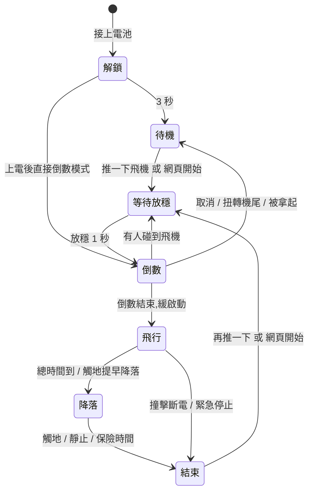

<div align="center">

# 線控飛機油門控制器

**ESP32-C3 電動線控特技機(F2B)自動油門**

依飛行時間軸與機頭角度自動調整電變油門,手機網頁調參數,不用發射機.


[](LICENSE)

<table>
<tr>
<td align="center"><br><sub>監看:姿態,油門曲線,事件紀錄</sub></td>
<td align="center"><br><sub>角度補償:拖曳曲線,撞牆檢查</sub></td>
<td align="center"><br><sub>計時器:兩段油門與時間軸</sub></td>
</tr>
</table>

</div>

---

> [!WARNING]
> **這是會讓馬達自動轉起來的裝置.** 設定,燒錄,測試時一律**拆下螺旋槳**.
> 必須加裝 **GPIO21 起飛安全開關**(見[接線](#接線)),沒按下時任何方式都不會開始起飛.
> 使用前請讀完 [安全設計](#安全設計),並自行承擔使用風險.

## 目錄

- [它能做什麼](#它能做什麼)
- [安全設計](#安全設計)
- [硬體](#硬體) · [接線](#接線)
- [飛行流程](#飛行流程)
- [快速開始](#快速開始)
- [網頁介面](#網頁介面)
- [韌體更新](#韌體更新)
- [專案結構](#專案結構) · [文件](#文件) · [開發與測試](#開發與測試) · [授權](#授權)

## 它能做什麼

電動線控特技機繞著人飛,飛手雙手握著操縱手柄,沒辦法控制油門. 這個控制器裝在飛機上,讀取機頭相對地平線的角度,依設定的時間軸與角度曲線自動控制電變:

**飛行控制**
- **兩段式飛行時間軸**:緩啟動 → 第一段油門 → 第二段油門(電池電壓下降時補回推力)→ 時間到自動降落. 換段方式三選一(直接跳 / 有過渡 / 平均分攤).
- **角度補償**:機頭朝上補油門,朝下減油門. 曲線每側 1~4 個點,可在網頁上直接拖曳,並即時標出補償後被上下限卡住的角度(撞牆檢查).
- **向心力補償姿態估算**:繞圈飛行的向心力約 3g,單靠加速度計算不出角度. 以陀螺儀加加速度計融合(Mahony),扣除由線長與單圈秒數換算的向心加速度.
- **自動降落與觸地判斷**:降落減力後,依觸地衝擊,完全靜止,地面滑行抖動判定落地關馬達;另有保險時間.
- **觸地提早降落**(選用):飛行中讓飛機正飛水平貼地滑行,就提早開始降落.
- **六組飛行風格**,各自命名,可互相複製.

**電變與周邊**
- 輸出協定 **PWM(50~400Hz)/ DShot150 / DShot300**,DShot300 支援**雙向轉速回傳**.
- **電變校正精靈**(上電自動輸出最高 → 最低油門)與**手動輸出滑桿**,附 19 款電變的官方校正步驟整理.
- **機輪收腳**舵機:起飛後設定秒數收輪,降落減力時放輪.

**網頁與系統**
- 手機直接連板子的 WiFi 熱點,或連家用 WiFi 用 `lineplane.local` 開啟. 飛行中網頁只能看不能改.
- **G 力與姿態紀錄**:板子持續記錄最近 10 分鐘,飛完在網頁看曲線,用來訂觸地與撞擊門檻.
- **事件紀錄**:降落,馬達停止,感測器異常,拒絕起飛等原因與數值,方便事後查「為什麼停了」.
- **板子自己下載更新韌體**,新韌體沒確認會自動退回舊版(見[韌體更新](#韌體更新)).

## 安全設計

控制器會自動啟動馬達,所以誤啟動與空中失去動力是設計時最優先處理的兩件事. 完整分析見 [docs/安全審查_2026-09-14.md](docs/安全審查_2026-09-14.md).

**不會在不該轉的時候轉**
| 情況 | 行為 |
|---|---|
| GPIO21 安全開關沒按下(或沒接,斷線) | 任何方式都不開始起飛程序 |
| 設定改了還沒儲存 | 拒絕起飛 |
| 感測器沒接上或故障 | 拒絕起飛;倒數中故障立刻取消 |
| 飛機沒放平(超過起飛前水平限制) | 拒絕起飛;倒數中被拿起傾斜 0.2 秒就取消 |
| 韌體更新中,新韌體還沒確認 | 拒絕起飛 |
| 網頁重開機,韌體更新完,當機重開 | 不會「上電後直接倒數」,只有真的拔電再接電才會 |
| 撞擊斷電之後 | 推飛機不算手勢,要按網頁「開始起飛程序」或重新上電 |
| 倒數中 | 可網頁取消,或抓著機尾扭轉取消;有人碰到飛機會延長或重新倒數 |
| 電變校正設定後 10 秒內沒拔電 | 自動取消,避免忘記後裝著螺旋槳接電就是全速 |

**不會莫名其妙在空中停**
- 撞擊斷電要**連續 10 毫秒**超過門檻才觸發,單筆感測器錯誤資料不會關馬達.
- 感測器飛行中故障:停止角度補償,照時間軸繼續飛到降落.
- 飛行中油門下限最低 10%,補償再怎麼減也不會變成沒動力.
- 飛行中不寫快閃記憶體,不改 WiFi,不檢查更新.
- 控制迴圈是 200Hz 獨立工作,優先權高於 WiFi;網頁或 WiFi 忙碌,連線卡住都不會拖慢飛行控制.
- 板子重新開機(例如供電電壓不足)馬達會停,這點程式救不了:供電要穩,重開原因會記在事件紀錄第一行.
- 緊急停止:網頁連按三下.

## 硬體

| 項目 | 型號 / 說明 |
|---|---|
| 主控 | ESP32-C3 SuperMini(4MB flash,原生 USB) |
| 感測器 | MPU6050(I2C,量程 ±2000°/秒,±16g) |
| 電變 | 一般 PWM 電變,或支援 DShot 的開源韌體電變(BLHeli_S,Bluejay,BLHeli_32,AM32) |
| 安全開關 | 微動開關 + 1kΩ 電阻(**必要**) |
| 收腳舵機 | 選用 |
| 供電 | 電變 BEC 5V 接板子 5V;建議與舵機分開供電,電壓不穩會讓板子重開(馬達立刻停) |

## 接線

| ESP32-C3 腳位 | 接到 | 備註 |
|---|---|---|
| GPIO4 | 電變訊號線 | 重置與燒錄期間沒有雜訊脈衝 |
| GPIO21 | **安全開關** → 1kΩ → GND | 按下(接地)才能起飛. 開機瞬間這腳會被拉高,串電阻保護腳位 |
| GPIO0 | MPU6050 SDA | 腳位可在 `src/pins_config.h` 修改 |
| GPIO1 | MPU6050 SCL | |
| GPIO3 | 收腳舵機訊號線 | 選用 |
| GPIO8 | 板載 LED | 狀態燈號 |
| 5V / GND | 電變 BEC | |

> [!TIP]
> 飛場上安全開關壞掉時,可以把開關兩腳跳線短路(保留串聯電阻)應急,行為等同開關一直按著. 回家後記得換回開關.

## 飛行流程



開始起飛程序(推飛機,網頁開始,上電倒數)都要**安全開關按下**. 燈號:待機長亮,等待放穩慢閃,倒數快閃,飛行中熄滅,正常結束閃 2 下,撞擊斷電閃 3 下.

## 快速開始

**1. 燒錄韌體**(第一次要用 USB)

安裝 [PlatformIO](https://platformio.org/),接上板子後:

```bash
pio run -e esp32c3_supermini -t upload
```

之後可以無線燒錄(`pio run -e ota -t upload`),或在網頁「系統」頁檢查更新.

**2. 連上網頁**

手機連 WiFi 熱點 `HappySuperGG_Plane`(密碼 `12345678`),瀏覽器開 `http://192.168.4.1`.
在「系統」頁填入家用 WiFi 後,之後可以用 `http://lineplane.local` 開啟.

**3. 設定**(每一步都要按上方的「儲存」)
1. **安裝**:選感測器朝機頭,朝機背的軸;飛機擺平飛姿勢,用角度修正讓讀值為 0°. 設定線長與單圈秒數.
2. **電變**:選輸出協定與脈寬,需要時做電變校正.
3. **計時器**:兩段油門,時間,緩啟動與降落.
4. **角度補償**:拖曳補償曲線,看撞牆檢查.
5. **設定**:啟動方式,倒數秒數,外力與觸地門檻.

**4. 起飛**:按下安全開關 → 推一下飛機(或網頁「開始起飛程序」)→ 放穩 → 倒數 → 起飛.

## 網頁介面

| 分頁 | 內容 |
|---|---|
| 監看 | 即時姿態圖與背景油門曲線,事件紀錄,感測器與輸出數值,安全開關狀態 |
| 計時器 | 六組飛行風格,時間軸圖,起飛/兩段/降落參數 |
| 角度補償 | 可拖曳的補償曲線,第一段/第二段,撞牆檢查,油門上下限 |
| 設定 | 啟動方式與倒數,手勢力道試推燈,外力,觸地提早降落,降落與撞擊 |
| 紀錄 | 最近 10 分鐘的角度,油門,G 力,抖動圖表 |
| 安裝 | 感測器安裝方位(側視/後視圖即時轉動),飛行速度,機輪收腳 |
| 電變 | 輸出協定,脈寬,手動輸出,校正精靈,各廠牌校正說明 |
| 系統 | 網路狀態,WiFi 設定(含設定保護與救援),韌體更新 |

<table>
<tr>
<td align="center"><br><sub>設定:啟動與倒數,試推燈</sub></td>
<td align="center"><br><sub>電變:協定,手動輸出,校正</sub></td>
</tr>
</table>

## 韌體更新

發布的韌體放在公開專案 **[ESP32lineplane-firmware](https://github.com/licni/ESP32lineplane-firmware)**,每天只留當天最新一版,附當天修改說明.

- 網頁「系統 → 韌體更新 → 檢查更新」,板子自己下載,比對大小與 SHA-256 檢查碼後安裝.
- 只有待機時能更新;更新中與新韌體確認前不能起飛.
- 板子重開後,開著的網頁會自動確認新韌體. 1 分鐘內沒有網頁連上,自動退回舊版 —— 由網頁確認,才能保證更新完之後還控制得到板子.
- WiFi 設定也有保護:改完沒按「保持」自動退回;完全連不上時,電池接上 5 秒內拔掉,連續 3 次,WiFi 回出廠設定.

## 專案結構

```
src/
  main.cpp            開機順序,序列埠指令
  control.cpp/.h      200Hz 控制工作:感測器,狀態機,電變輸出
  flight.cpp/.h       飛行狀態機:手勢,倒數,時間軸,補償,降落,撞擊
  imu.cpp/.h          MPU6050 讀取與向心力補償 Mahony 姿態
  impact.cpp/.h       觸地衝擊與地面滑行抖動判斷
  esc_output.cpp/.h   PWM / DShot / 雙向 DShot 輸出
  esc_service.cpp/.h  電變校正旗標,開機重置原因
  settings.cpp/.h     參數表驅動的設定與 NVS 存檔(含舊版轉移)
  wifi_manager.cpp/.h WiFi,熱點,mDNS,無線燒錄,設定保護
  web_server.cpp/.h   網頁 API
  web_page.h          整個網頁(HTML/CSS/JS 內嵌)
  fw_update.cpp/.h    韌體下載更新,確認與自動退回
  gear.cpp/.h         機輪收腳舵機
  pins_config.h       腳位設定
  version.h           韌體版本號與更新來源
tools/                實機測試與模擬腳本(見 tools/README.md)
docs/                 規格,安全審查,測試報告,查證紀錄,開發紀錄
platformio.ini        建置設定(發布的韌體不帶本機路徑,見 tools/pio_strip_paths.py)
LICENSE               GPL-3.0
```

## 文件

| 文件 | 內容 |
|---|---|
| [規格草案](docs/規格草案_2026-09-13.md) | 完整功能規格與設計決定 |
| [安全審查](docs/安全審查_2026-09-14.md) | 誤啟動與空中失去動力的逐條路徑分析 |
| [全功能測試報告](docs/全功能測試報告_2026-09-13.md) | 桌上實機測試結果 |
| [電變校正說明查證](docs/電變校正說明查證_2026-09-13.md) | 19 款電變的官方校正步驟與出處 |
| [雙向 DShot 查證](docs/雙向DShot與EDT查證_2026-09-13.md) | 雙向 DShot 協定與實作查證 |
| [開發紀錄](docs/開發紀錄.md) | 每一段開發做了什麼,測試結果 |

## 開發與測試

- 編譯與燒錄全部用 PlatformIO,平台為 [pioarduino](https://github.com/pioarduino/platform-espressif32) 55.03.311(Arduino 核心 3.3.11),分割表 `min_spiffs`(兩個應用程式插槽,供 OTA 與自動退回使用).
- `tools/` 裡是實機測試腳本:板子接 USB,透過網頁 API 與序列埠指令(感測器模擬,安全開關覆寫,脈寬量測)跑完整判斷流程,測試前備份板上設定,結束還原比對. 說明見 [tools/README.md](tools/README.md).
- 測試用序列埠指令只能從 USB 開啟,存在記憶體,不影響飛行.

## 授權

Copyright (C) 2026 SuperGG

本專案以 **[GNU General Public License v3.0](LICENSE)**(GPL-3.0)授權發布:
- 可以自由使用,研究,修改,再發布.
- 修改後再發布(包含發布編譯好的韌體)時,必須同樣以 GPL-3.0 提供完整原始碼,並保留原作者與授權聲明.
- 本軟體**不提供任何擔保**,使用風險自行承擔(見授權條款第 15,16 條). 控制器會自動啟動馬達,使用前請先讀開頭的安全警告與[安全設計](#安全設計).

---

<div align="center">

設計開發者:**SuperGG** · Line 社群:**RotorFlightTW**

</div>
