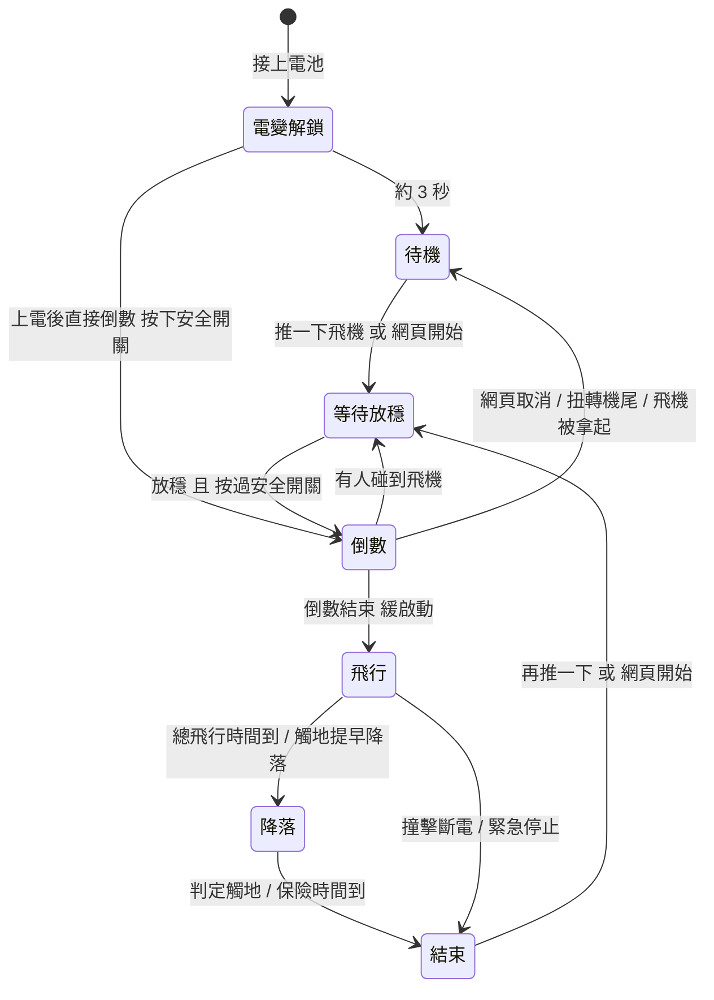
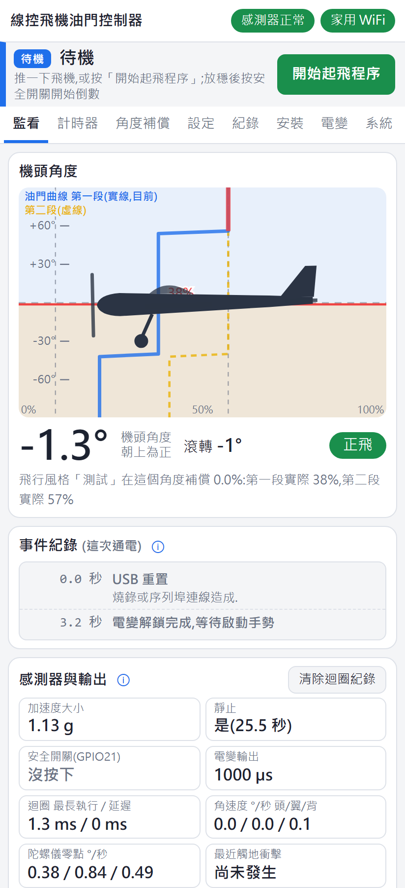
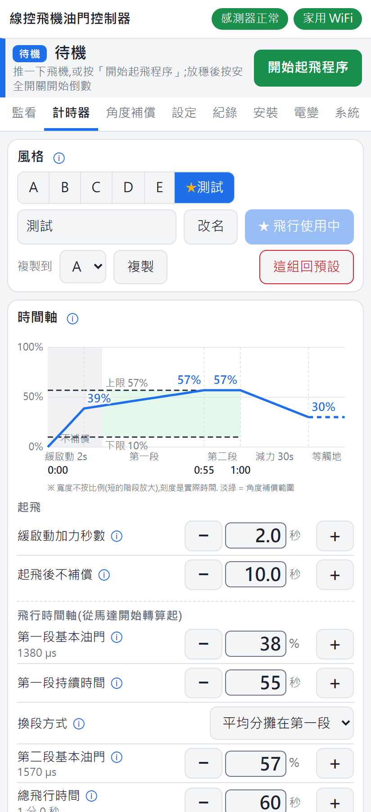
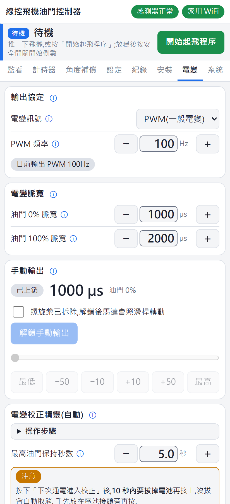
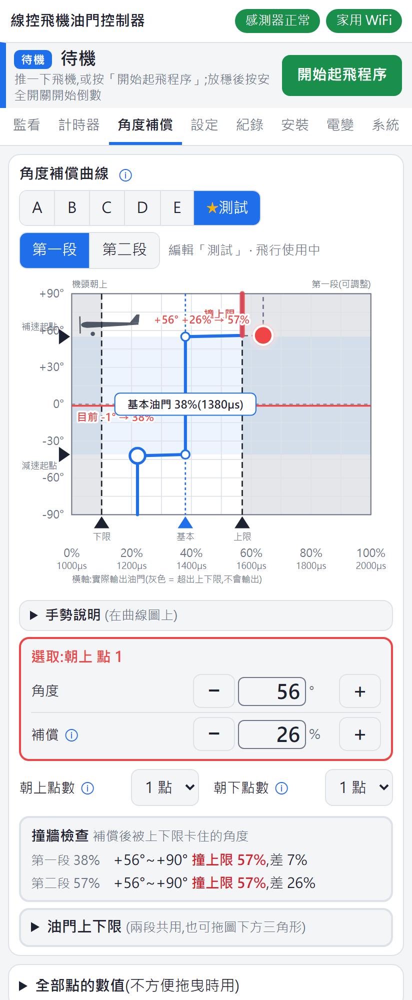
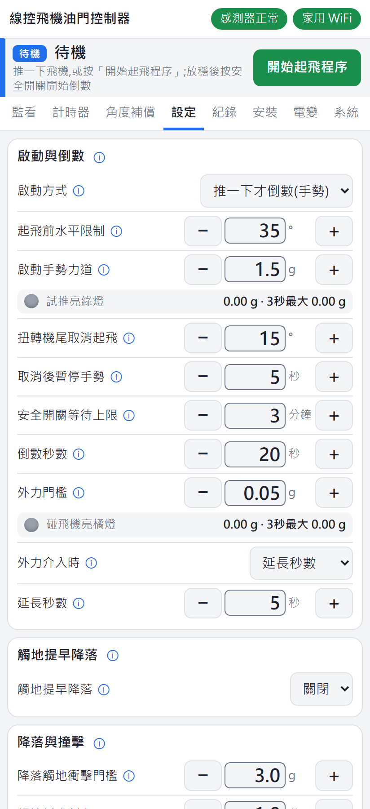

# 線控飛機油門控制器 使用說明書

**適用韌體**:2026.09.14.12 以後(網頁「系統」頁可以看目前的韌體版本)

**適用對象**:已經拿到控制器,韌體已經燒好,**起飛安全開關與感測器(MPU6050)都已經接好**的飛友.
這份說明從接上電變與收腳舵機開始,接著是第一次連上板子,每一個參數的用法與設計用意,起飛操作,到問題排除.

> [!WARNING]
> **這是會自己讓馬達轉起來的裝置.** 接線,設定,測試時一律**拆下螺旋槳**.
> 第一次使用前,請先讀完 [1. 安全須知](#1-安全須知).

## 目錄

<!-- TOC -->
- [1. 安全須知](#1-安全須知)
- [2. 認識控制器](#2-認識控制器)
  - [2.1 它在做什麼](#21-它在做什麼)
  - [2.2 板子上有什麼](#22-板子上有什麼)
  - [2.3 腳位總表](#23-腳位總表)
  - [2.4 一次飛行的流程](#24-一次飛行的流程)
- [3. 接線](#3-接線)
  - [3.1 接電變](#31-接電變)
  - [3.2 接收腳舵機](#32-接收腳舵機)
  - [3.3 確認安全開關與感測器](#33-確認安全開關與感測器)
  - [3.4 裝進飛機](#34-裝進飛機)
- [4. 第一次連上板子](#4-第一次連上板子)
  - [4.1 通電](#41-通電)
  - [4.2 手機連板子的熱點](#42-手機連板子的熱點)
  - [4.3 認識網頁畫面](#43-認識網頁畫面)
  - [4.4 讓板子連家用 WiFi](#44-讓板子連家用-wifi)
  - [4.5 完全連不上板子時](#45-完全連不上板子時)
- [5. 網頁的基本操作](#5-網頁的基本操作)
  - [5.1 八個分頁](#51-八個分頁)
  - [5.2 調整參數](#52-調整參數)
  - [5.3 儲存 放棄 與鎖定](#53-儲存-放棄-與鎖定)
  - [5.4 飛行風格](#54-飛行風格)
  - [5.5 共用設定與風格設定](#55-共用設定與風格設定)
- [6. 首次設定流程](#6-首次設定流程)
- [7. 安裝頁](#7-安裝頁)
  - [7.1 感測器安裝方位](#71-感測器安裝方位)
  - [7.2 角度修正](#72-角度修正)
  - [7.3 圖示機頭方向](#73-圖示機頭方向)
  - [7.4 飛行速度](#74-飛行速度)
  - [7.5 機輪收腳](#75-機輪收腳)
- [8. 電變頁](#8-電變頁)
  - [8.1 輸出協定](#81-輸出協定)
  - [8.2 電變脈寬](#82-電變脈寬)
  - [8.3 手動輸出](#83-手動輸出)
  - [8.4 電變校正精靈](#84-電變校正精靈)
  - [8.5 各廠牌校正說明](#85-各廠牌校正說明)
- [9. 計時器頁](#9-計時器頁)
  - [9.1 時間軸圖](#91-時間軸圖)
  - [9.2 起飛](#92-起飛)
  - [9.3 兩段飛行](#93-兩段飛行)
  - [9.4 降落](#94-降落)
- [10. 角度補償頁](#10-角度補償頁)
  - [10.1 補償是什麼](#101-補償是什麼)
  - [10.2 看懂曲線圖](#102-看懂曲線圖)
  - [10.3 怎麼調整](#103-怎麼調整)
  - [10.4 曲線的出廠值](#104-曲線的出廠值)
  - [10.5 第二段與撞牆檢查](#105-第二段與撞牆檢查)
  - [10.6 油門上下限](#106-油門上下限)
  - [10.7 在監看頁驗證](#107-在監看頁驗證)
- [11. 設定頁](#11-設定頁)
  - [11.1 啟動方式](#111-啟動方式)
  - [11.2 起飛前水平限制](#112-起飛前水平限制)
  - [11.3 啟動手勢力道](#113-啟動手勢力道)
  - [11.4 扭轉機尾取消起飛](#114-扭轉機尾取消起飛)
  - [11.5 安全開關等待上限](#115-安全開關等待上限)
  - [11.6 倒數秒數](#116-倒數秒數)
  - [11.7 外力門檻與外力介入](#117-外力門檻與外力介入)
  - [11.8 觸地提早降落](#118-觸地提早降落)
  - [11.9 降落與撞擊](#119-降落與撞擊)
  - [11.10 共用設定回預設](#1110-共用設定回預設)
- [12. 起飛與飛行操作](#12-起飛與飛行操作)
  - [12.1 拆槳演練](#121-拆槳演練)
  - [12.2 每次飛行前檢查](#122-每次飛行前檢查)
  - [12.3 起飛推一下才倒數](#123-起飛推一下才倒數)
  - [12.4 起飛上電後直接倒數](#124-起飛上電後直接倒數)
  - [12.5 取消起飛](#125-取消起飛)
  - [12.6 飛行中](#126-飛行中)
  - [12.7 降落與結束](#127-降落與結束)
  - [12.8 撞擊斷電之後](#128-撞擊斷電之後)
  - [12.9 緊急停止](#129-緊急停止)
  - [12.10 拒絕啟動的原因](#1210-拒絕啟動的原因)
- [13. 監看頁與紀錄頁](#13-監看頁與紀錄頁)
  - [13.1 監看頁](#131-監看頁)
  - [13.2 事件紀錄](#132-事件紀錄)
  - [13.3 紀錄頁](#133-紀錄頁)
  - [13.4 用紀錄訂門檻](#134-用紀錄訂門檻)
- [14. 系統頁](#14-系統頁)
  - [14.1 網路狀態](#141-網路狀態)
  - [14.2 WiFi 設定](#142-wifi-設定)
  - [14.3 設定保護](#143-設定保護)
  - [14.4 韌體更新](#144-韌體更新)
  - [14.5 手動上傳韌體檔](#145-手動上傳韌體檔)
- [15. 燈號對照表](#15-燈號對照表)
- [16. 疑難排解](#16-疑難排解)
  - [16.1 連線](#161-連線)
  - [16.2 起飛](#162-起飛)
  - [16.3 電變與馬達](#163-電變與馬達)
  - [16.4 飛行與降落](#164-飛行與降落)
  - [16.5 感測器與收腳](#165-感測器與收腳)
  - [16.6 韌體更新](#166-韌體更新)
- [附錄 A 參數總表](#附錄-a-參數總表)
- [附錄 B 各種回預設](#附錄-b-各種回預設)
- [附錄 C 名詞解釋](#附錄-c-名詞解釋)
<!-- /TOC -->

---

## 1. 安全須知

控制器在你雙手握著操縱手柄,沒辦法控制油門的時候替你控制油門,所以它會**自己啟動馬達**. 請先記住這幾件事:

1. **拆槳**:接線,改設定,手動輸出,電變校正,演練起飛流程時,一律先拆下螺旋槳.
2. **起飛安全開關**:推飛機,網頁「開始起飛程序」,上電倒數都會照常開始起飛程序,但**要按下安全開關才會開始倒數**;沒按就等,馬達不會轉,超過 3 分鐘(可調)自動取消. 沒接開關或線斷掉也算沒按下,永遠不會倒數.
3. **設定要儲存才能起飛**:網頁上改了參數沒按「儲存」,板子會拒絕起飛,避免飛完才發現剛才調的沒存.
4. **「上電後直接倒數」模式要特別小心**:這個模式接上電池後,按下安全開關(飛機放平)就開始倒數;接電池時開關已經按著,電變解鎖完就直接倒數. 出廠是「推一下才倒數」模式.
5. **電變校正會輸出最高油門**:校正時馬達可能全速轉. 按下「下次通電進入校正」後 10 秒內沒拔電,會自動取消.
6. **緊急停止**:馬達運轉中,網頁頂部的「緊急停止」要**連按三下**才生效(避免手機誤觸). 最後手段是直接拔掉電池.
7. **供電要穩**:板子只要重新開機,馬達就會停. BEC 電壓不足,舵機頂死把電壓拉低,接頭鬆脫,都可能造成空中停車. 重新開機的原因會記在監看頁事件紀錄的第一行.
8. **飛行中網頁只能看,不能改**:從等待放穩,倒數到飛行結束,設定都鎖定,WiFi 設定與韌體更新也不能動.
9. **撿飛機前先拔電池**是最安全的習慣. 手勢模式落地後推到飛機會再次開始起飛程序,這時再碰到安全開關就會開始倒數.

---

## 2. 認識控制器

### 2.1 它在做什麼

電動線控特技機繞著你飛,你雙手握著手柄,沒辦法控制油門. 控制器裝在飛機上,依你設定的方式自動控制電變:

- **時間軸**:倒數結束後馬達緩緩加速起飛,先用「第一段油門」飛一段時間,再換成「第二段油門」(飛到後段電池電壓下降,用較高的油門補回推力). 總飛行時間到了就自動降落,判斷觸地後關馬達.
- **角度補償**:感測器量機頭相對地平線的角度. 機頭朝上(爬升)加油門,機頭朝下(俯衝)減油門,讓繞圈的速度比較穩定.
- **安全判斷**:按下安全開關才開始倒數;起飛前檢查是否已儲存,感測器,飛機是否放平;倒數中有人碰到飛機會延長倒數;飛行中偵測到撞擊立即斷電.

### 2.2 板子上有什麼

| 項目 | 說明 |
|---|---|
| 主控板 | ESP32-C3 SuperMini,內建 WiFi. 手機直接連它的 WiFi 熱點,用瀏覽器調參數 |
| 感測器 | MPU6050(已接好),量機頭角度與 G 力 |
| 起飛安全開關 | 微動開關(已接好),按下(接地)才開始倒數 |
| 狀態燈 | 板子上的藍色 LED,燈號見 [15. 燈號對照表](#15-燈號對照表) |
| 電變輸出 | GPIO4,接電變的訊號線 |
| 收腳舵機輸出 | GPIO3,接收腳舵機的訊號線(選用) |

### 2.3 腳位總表

| 腳位 | 接到 | 誰要接 |
|---|---|---|
| GPIO4 | 電變訊號線 | **你要接**,見 [3.1](#31-接電變) |
| 電源輸入(降壓板)/ GND | 電變 BEC 的 + / −(6~9V) | **你要接**,見 [3.1](#31-接電變) |
| GPIO3 | 收腳舵機訊號線 | **你要接**(選用),見 [3.2](#32-接收腳舵機) |
| GPIO21 | 起飛安全開關(串 1kΩ 電阻到 GND) | 已接好 |
| GPIO5 / GPIO6 | MPU6050 的 SDA / SCL | 已接好 |
| GPIO8 | 板載藍色 LED | 板子內建 |

### 2.4 一次飛行的流程

| 階段 | 狀態燈 | 發生什麼事 |
|---|---|---|
| 電變解鎖 | 熄滅 | 接上電池後約 3 秒,送最低油門讓電變解鎖,這段時間不接受啟動 |
| 待機 | 長亮 | 等你開始起飛程序 |
| 等待放穩 | 慢閃 | 開始起飛程序後,等飛機放在地上靜止 1 秒,並等安全開關按下 |
| 倒數 | 快閃 | 倒數秒數(出廠 20 秒),你走到手柄 |
| 飛行 | 熄滅 | 緩啟動 → 第一段 → 第二段 → 降落 |
| 結束 | 閃 2 下停一下 | 馬達已停(觸地停車,保險時間到,緊急停止). 撞擊斷電是閃 3 下停一下 |

飛行時間軸**從馬達開始轉算起**,不是從接上電池算起.

---

## 3. 接線

> [!IMPORTANT]
> 接線前拔掉電池與 USB 線. 螺旋槳先不要裝.

### 3.1 接電變

電變的油門線是一條三芯的舵機線:

| 電變油門線 | 常見顏色 | 接到控制器 |
|---|---|---|
| 訊號 | 白 / 黃 / 橘 | **GPIO4** |
| + (BEC 輸出) | 紅 | **電源輸入**(降壓板) |
| − (地) | 黑 / 棕 | **GND** |

- **一定要共地**:電變的地線要接到控制器的 GND,訊號才讀得到.
- **供電**:控制器由電變的 BEC 供電,板子上有降壓板,**BEC 電壓 6~9V**.
- **光耦(OPTO)電變沒有 BEC**:紅線沒有電,要另外接一顆 6~9V 的 UBEC 給控制器,地線一樣要共地.
- 訊號線盡量短,遠離馬達的三條動力線.
- **平常不需要接 USB**:設定,查看紀錄,韌體更新都用 WiFi. 需要時 USB 可以和電池同時接(有二極體保護).
- **馬達轉向**:接好之後用電變頁的手動輸出確認(見 [8.3](#83-手動輸出)),轉向反了就對調馬達任意兩條線.
- **油門行程**:一般 PWM 電變第一次使用要校正,見 [8.4](#84-電變校正精靈).

### 3.2 接收腳舵機

沒有收腳的飛機跳過這一節.

| 舵機線 | 接到 |
|---|---|
| 訊號(白 / 黃 / 橘) | **GPIO3** |
| + (紅) | 從 BEC 分電(見下方) |
| − (黑 / 棕) | GND,和控制器共地 |

- **電源**:舵機電源從電變的 BEC 分電,不經過控制器板子(舵機動作電流大,卡住頂死時更大). 地線要和控制器共地.
- **確認舵機的額定電壓**:舵機直接吃 BEC 的電壓(6~9V). 一般舵機多半只到 6V,BEC 電壓比較高時要用高壓(HV)舵機,而且 BEC 電壓不能超過舵機的上限.
- **一通電,舵機就會走到「放下」的位置**,就算收輪功能沒開也一樣(讓裝了收腳的飛機輪子保持放下).
- 出廠行程只開 1400~1600µs 的小行程,一般不會頂到機構. 第一次接上時仍建議先把收腳連桿脫開,確認方向與行程之後再接回.
- 設定方法見 [7.5 機輪收腳](#75-機輪收腳).

### 3.3 確認安全開關與感測器

這兩樣已經接好,連上網頁之後(見第 4 章)確認一下:

- **安全開關**:監看頁「感測器與輸出」的「安全開關(GPIO21)」,按下時顯示「**已按下**」,放開顯示「**沒按下**」.
- **感測器**:網頁最上面顯示「**感測器正常**」. 顯示「感測器未連接」或「感測器故障,請重新上電」時不能起飛,見 [16. 疑難排解](#16-疑難排解).

安全開關的規則:

- **起飛程序照常開始,按下安全開關才開始倒數**. 推飛機或按網頁「開始起飛程序」之後,飛機放穩而且按過安全開關,才開始倒數;上電後直接倒數模式,電變解鎖後按下安全開關(飛機放平)才開始倒數.
- 飛機放穩之前或之後按都可以,**按一下就會記住**. 按開關時碰動了飛機沒關係,飛機重新靜止 1 秒就開始倒數.
- 開始起飛程序時開關已經按著,也算按過.
- 倒數開始之後放開開關,不影響倒數與飛行;倒數中被碰到而退回等待放穩,重新放穩後繼續倒數,不必再按.
- 接地(按下)持續 50 毫秒才算按下.
- 用途是確認「有人在飛機旁邊,確定要飛了」. 沒接開關或線斷掉,永遠不會開始倒數.
- 起飛程序開始後**超過 3 分鐘沒按,自動取消**(設定頁「安全開關等待上限」可調,見 [11.5](#115-安全開關等待上限)).

> [!TIP]
> **飛場上安全開關壞掉的應急**:把開關兩腳用跳線短路(保留串聯的 1kΩ 電阻),行為就等於開關一直按著,可以照常起飛,但安全開關的保護也跟著消失. 回家記得換回開關.
> 不要用裸線把 GPIO21 直接接地:開機瞬間這隻腳會被拉高,要靠電阻保護.

### 3.4 裝進飛機

- 控制器(含感測器)要**固定牢靠**,不能晃動. 震動造成接觸不良時感測器會故障,故障後這次通電就不再使用感測器,要重新上電.
- 感測器可以任意方向安裝,但裝好之後一定要到安裝頁設定方位與角度修正,見 [7.1](#71-感測器安裝方位).
- 狀態燈最好從外面看得到,不用開手機就知道目前的狀態.
- 螺旋槳平衡要做好. 震動太大會讓感測器量程飽和(事件紀錄會出現「感測器量程飽和」).

---

## 4. 第一次連上板子

### 4.1 通電

1. 確認螺旋槳已拆下.
2. 接上電池,控制器與電變一起通電.
3. 看狀態燈:先**熄滅**約 3 秒(電變解鎖中,電變會發出解鎖提示音),然後**長亮**(待機).

> [!NOTE]
> 出廠是「推一下才倒數」模式. 接上電池後只會停在待機,不會自己倒數.

### 4.2 手機連板子的熱點

板子沒有設定家用 WiFi,或附近找不到家用 WiFi 時,會自己開 WiFi 熱點:

1. 手機打開 WiFi,連 **HappySuperGG_Plane**(名稱後面可能接了字,例如 HappySuperGG_Plane3),密碼 **12345678**.
2. 手機提示「這個網路無法連上網際網路」時,選**保持連線**. 有些手機會自動切回行動網路,網頁打不開時先把行動數據關掉.
3. 瀏覽器輸入 **http://192.168.4.1**(要打 `http://`).
4. 看到「線控飛機油門控制器」網頁就成功了. 建議把網頁加到手機主畫面,之後一點就開.

熱點密碼固定是 12345678,不能改,避免改了之後忘記就再也連不上.

### 4.3 認識網頁畫面

*監看頁(畫面上的數值只是範例)*

由上往下:

- **第一行:狀態**
  - 感測器:「感測器正常」(綠),「感測器未連接」或「感測器故障,請重新上電」(紅).
  - 網路:「自身熱點」,「家用 WiFi」,「連線中」,「連線中斷」(手機和板子斷線).
  - 有未儲存的變更時,這一行換成紅色的「**未儲存,不能起飛**」與「儲存」「放棄」按鈕.
  - 起飛程序與飛行中顯示「設定已鎖定」.
- **第二行:飛行狀態列**:目前的狀態與下一步要做什麼. 依狀態出現「開始起飛程序」,「取消倒數」,「緊急停止(連按三下)」按鈕. 顏色:藍邊(待機),黃色(等待放穩,等待安全開關),橘色閃動(倒數),綠色(馬達運轉),藍色(降落),紅色(撞擊斷電);淺紅色是拒絕啟動.
- **提示列**(需要時才出現):WiFi 設定試用中要按「保持」;韌體更新中請勿斷電.
- **分頁**:監看,計時器,角度補償,設定,紀錄,安裝,電變,系統.

### 4.4 讓板子連家用 WiFi

這一節是**選用**的.

**什麼時候需要**:網頁「檢查更新」與下載韌體需要能上網的家用 WiFi. 在家調參數時連家用 WiFi 也比較方便(手機不用切換網路). 飛場上沒有家用 WiFi,板子會自己改開熱點,照 [4.2](#42-手機連板子的熱點) 連就好.

步驟:

1. 連上板子熱點,開「系統」頁的「WiFi 設定」.
2. 填「家用 WiFi」名稱與「WiFi 密碼」. 密碼至少 8 碼;沒有密碼的開放網路,密碼留空.
3. 按「**儲存 WiFi 設定**」,再按「**重新開機**」.
4. 手機連回家用 WiFi,瀏覽器開 **http://lineplane.local**.
5. 網頁上方出現黃色提示列(WiFi 設定剛變更),連線正常就按提示列上的「**保持**」. 3 分鐘內沒按,板子會自動改回上一次的設定(設計用意見 [14.3](#143-設定保護)).

> [!TIP]
> 有些 Android 手機打不開 `.local` 網址. 先用電腦或 iPhone 開 `http://lineplane.local`,在系統頁「網路狀態」看板子的 IP 位址,Android 手機改用這個 IP 開;或到路由器後台的連線裝置清單找.

板子開機時的連線規則:

- **有設定家用 WiFi**:開機先掃描,連訊號最強的同名基地台. 附近掃不到這個名稱就**立刻**開熱點;掃得到但「等待秒數」(出廠 30 秒)內連不上,也改開熱點.
- **使用中家用 WiFi 斷線**:每 5 秒重連一次,超過等待秒數連不回來就改開熱點. 家用 WiFi 恢復後,重新開機才會再連回去.
- **勾「一律用熱點」**:不管家用 WiFi,開機直接開熱點.

### 4.5 完全連不上板子時

WiFi 設定改壞了,熱點名稱忘了,怎樣都連不上時,用**開關電救援**:

1. 接上電池,**5 秒內**拔掉.
2. 再接上電池,**5 秒內**拔掉.
3. **第三次**接上電池就不用拔:WiFi 設定回出廠. 熱點回到 HappySuperGG_Plane(密碼 12345678),清除家用 WiFi 與熱點名稱後面接的字,裝置名稱回 lineplane,取消「一律用熱點」,發射功率回 5dBm,等待秒數回 30 秒.

- 只算真的拔電再接電,網頁重新開機不算. 中間任何一次通電超過 5 秒,就要從頭數.
- 飛行設定(計時器,角度補償,設定頁等)不受影響.
- 事件紀錄會記「連續開關電 3 次:WiFi 設定已回出廠」.

---

## 5. 網頁的基本操作

### 5.1 八個分頁

| 分頁 | 內容 | 什麼時候用 |
|---|---|---|
| 監看 | 即時機頭角度與油門曲線,事件紀錄,感測器數值,安全開關狀態 | 隨時;查「為什麼沒起飛」「為什麼停了」 |
| 計時器 | 飛行風格(六組),時間軸:緩啟動,兩段油門與時間,降落 | 調飛法 |
| 角度補償 | 補償曲線,第一段 / 第二段,撞牆檢查,油門上下限 | 調飛法 |
| 設定 | 啟動方式,倒數,外力,觸地提早降落,降落與撞擊 | 裝機時設好,偶爾微調 |
| 紀錄 | 最近 10 分鐘的角度,油門,G 力,抖動圖表 | 飛完看,用來訂門檻 |
| 安裝 | 感測器安裝方位,角度修正,飛行速度,機輪收腳 | 裝機時設一次 |
| 電變 | 輸出協定,脈寬,手動輸出,電變校正,各廠牌校正說明 | 裝機時設一次 |
| 系統 | 網路狀態,WiFi 設定,韌體更新 | 需要時 |

### 5.2 調整參數

每個參數一列:名稱,ⓘ,−,數值,+.

- **按一下 − 或 +**:走一小格(細調).
- **按住 − 或 +**:約 0.4 秒後開始連續走,越按越快,約 2 秒後改用大步進(粗調). 放開手指才確定.
- **直接輸入**:點數值框輸入數字,按 Enter 或點別的地方送出.
- **ⓘ**:點參數名稱旁的 ⓘ 展開這個參數的說明;卡片標題旁的 ⓘ 是整張卡片的說明.
- 名稱下方的小字是換算值:油門百分比旁邊顯示實際脈寬(µs),60 秒以上的時間顯示幾分幾秒.
- 超出範圍,或和其他參數衝突(例如第一段時間加到超過總飛行時間)時,板子會拒絕,畫面下方跳出原因,數值停在最後一個被接受的值.

### 5.3 儲存 放棄 與鎖定

- 參數一改就送到板子上(待機時馬上生效,例如試推燈的門檻,收腳舵機的行程),但**還沒寫進記憶體**.
- 有未儲存的變更時,網頁最上面變成紅色「**未儲存,不能起飛**」:
  - **儲存**:寫進板子,斷電也會保留.
  - **放棄**:全部回到上一次儲存的值.
- **有未儲存的變更時,板子拒絕起飛**. 這是故意的:避免飛完才發現剛才調的沒存,下次通電又回到舊的值.
- 從開始起飛程序(推飛機或按網頁開始之後,等待放穩與等待安全開關也算)到飛行結束,設定**鎖定**,最上面顯示「設定已鎖定」,網頁只能看. 不想飛了按「取消倒數」就解除;還沒按安全開關的話,超過安全開關等待上限也會自動取消並解除. 開始起飛程序的那一刻,板子把設定複製一份給這趟飛行用,之後網頁怎麼改都不影響這趟飛行.

### 5.4 飛行風格

*計時器頁最上面是飛行風格(畫面上的數值只是範例)*

計時器頁與角度補償頁最上面的一排按鈕是**飛行風格**:A,B,C,D,E,TEST 共六組. 每組有自己的時間軸,油門與補償曲線,例如「新電池」「冬天」「比賽」各存一組.

- **★** 是飛行時使用的那一組. **紅點**表示這組有未儲存的變更.
- 點按鈕切換**要編輯**哪一組(不會改變飛行使用哪一組). 計時器頁和角度補償頁一起切換.
- **改名**:輸入名稱按「改名」,最多約 7 個中文字. 改名後要按儲存.
- **設為飛行使用**:把正在編輯的這組設成 ★. **立刻生效並記住,不用按儲存**.
- **複製到**:把這組的全部飛法複製到選的那一組,目標組保留自己的名字. 要按儲存.
- **這組回預設**:這組的飛法回到出廠值,名字保留. 按儲存才真的寫入,按放棄可以救回.
- **TEST** 組的規則和其他組完全一樣(也要儲存才能起飛),適合做拆槳演練或試新設定.

### 5.5 共用設定與風格設定

| 每組風格各自一份 | 所有風格共用 |
|---|---|
| 計時器頁:緩啟動,起飛後不補償,兩段油門與時間,換段方式,降落 | 設定頁:啟動方式,倒數,外力,觸地提早降落,降落與撞擊 |
| 角度補償頁:補償曲線,油門上下限 | 安裝頁:感測器方位,角度修正,圖示方向,飛行速度,機輪收腳 |
| | 電變頁:輸出協定,脈寬,校正保持秒數 |
| | 系統頁:WiFi 設定(另外存放,各種「回預設」都不會動到) |

---

## 6. 首次設定流程

第一次使用,建議照這個順序設定. 每一步做完都按**儲存**.

1. **安裝頁**:感測器安裝方位 → 角度修正 → 飛行速度. 見 [第 7 章](#7-安裝頁).
2. **電變頁**:選輸出協定 → 儲存 → 拔電池重新接上 → 手動輸出確認馬達轉向 → PWM 電變做油門行程校正. 見 [第 8 章](#8-電變頁).
3. **安裝頁**:機輪收腳(有收腳才做). 見 [7.5](#75-機輪收腳).
4. **計時器頁**:緩啟動,兩段油門與時間,降落. 見 [第 9 章](#9-計時器頁).
5. **角度補償頁**:補償曲線與油門上下限. 見 [第 10 章](#10-角度補償頁).
6. **設定頁**:啟動方式,倒數秒數,手勢力道,外力門檻. 見 [第 11 章](#11-設定頁).
7. **拆槳演練**:用 TEST 風格把時間設短,完整跑一次從起飛到降落. 見 [12.1](#121-拆槳演練).

---

## 7. 安裝頁

安裝頁的設定裝機時做一次,之後很少改.

### 7.1 感測器安裝方位

控制器要知道感測器晶片哪一軸朝機頭,哪一軸朝機背(座艙頂),才算得出機頭角度.

1. 看感測器模組板上印的 **X,Y 箭頭**. **Z 軸**垂直板面,朝元件那一面是 +Z.
2. 「**朝機頭**」選晶片哪一軸指向機頭,「**朝機背**」選哪一軸指向座艙頂. 兩個不能是同一軸(+X 配 −X 也不行).
3. 「**朝左翼**」依右手定則自動算出來,不用選. 繞圈的向心力就在這個方向,姿態計算會用到.
4. **檢查**(畫面上有兩張圖,會跟著感測器即時轉動):
   - **側視圖**(站在圓心看,左翼朝你):**抬起機頭**,圖上的機頭也要抬起.
   - **後視圖**(站在機尾往機頭看):**抬起左翼**,圖上的左翼也要抬起.
   - 方向相反就是軸選錯了.
5. 按儲存.

出廠預設:晶片 +X 朝機頭,+Z 朝機背(+Y 朝左翼),角度修正 0°. 畫面右側會顯示目前是「出廠預設」還是「和出廠預設不同」. 設亂了可以按「**方位回預設**」,確認沒問題再按儲存.

### 7.2 角度修正

| 參數 | 出廠 | 範圍 | 說明 |
|---|---|---|---|
| 角度修正 | 0° | −30~+30°,細調 0.1° | 加到量到的角度上 |

- **目的**:讓飛機**平飛時**讀到 0°.
- **做法**:把飛機擺成平飛姿勢(用你平常調機的水平基準),看「**控制使用**」的讀值. 讀到 +2° 就把角度修正設成 −2.
- 「晶片原始」是修正前的角度,「控制使用」是修正後的角度. 角度補償與起飛前水平限制都用「控制使用」的角度.
- **設計用意**:控制器不做「放在地上歸零」. 飛機停在地上的姿勢不等於平飛(後三點飛機停放時機頭朝上),所以由你擺出真正的平飛姿勢來修正.

### 7.3 圖示機頭方向

「圖示機頭」選「**朝左(逆時針飛)**」或「**朝右(順時針飛)**」. 只影響網頁上飛機圖示的方向,不影響控制. 出廠朝左.

### 7.4 飛行速度

| 參數 | 出廠 | 範圍 | 說明 |
|---|---|---|---|
| 線長 | 18 公尺 | 5~30 公尺,細調 0.1 | 大概的值即可 |
| 單圈秒數 | 5.2 秒 | 2~10 秒,細調 0.1 | 飛一圈大約幾秒 |

- 卡片下方顯示換算的飛行速度,出廠值約 21.7 m/s(78 km/h).
- **設計用意**:繞圈飛行的向心力約 3g,加速度計量到的「下方」會嚴重偏掉,單靠加速度計算不出機頭角度. 控制器用線長與單圈秒數換算飛行速度,扣掉向心力,再和陀螺儀的資料融合. 只在馬達運轉時套用(在地上拿著轉動時,速度當成 0).
- 數值大概填對就好;換了明顯不同的線長再改.

### 7.5 機輪收腳

| 參數 | 出廠 | 範圍 | 說明 |
|---|---|---|---|
| 收輪功能 | 關閉 | 關閉 / 開啟 | 沒有收腳的飛機保持關閉. 開啟後才顯示下面幾項 |
| 起飛後幾秒收輪 | 5 秒 | 1~120 秒 | 從馬達開始轉算起 |
| 舵機速度 | 2.0 秒 | 0~10 秒,0 = 舵機自己的最快速度 | 輪子從放下到收起花的秒數 |
| 舵機行程下限 | 1400 µs | 500~1500 µs | 舵機一端的位置 |
| 舵機行程上限 | 1600 µs | 1500~2500 µs,至少比下限大 100 | 舵機另一端的位置 |
| 舵機方向 | 正轉(收起在上限) | 正轉 / 反轉(收起在下限) | 正轉:放下在下限,收起在上限;反轉相反 |

**什麼時候收,什麼時候放**

- 馬達開始轉之後,到「起飛後幾秒收輪」時收起.
- **開始降落(減力一開始)時放下**.
- 緊急停止,撞擊斷電等馬達停下時,馬上開始放下.
- 開機,待機,倒數中一律放下.
- **觸地提早降落開啟時不收輪**:不知道你什麼時候要貼地提早降落,輪子必須一直放著. 這時收腳卡片會顯示「收輪不作用」.

**調整步驟**

1. 第一次先把收腳連桿脫開,或確認小行程不會頂到機構.
2. 「收輪功能」選開啟.
3. 按「**試收輪**」:舵機收起,10 秒後自動放下(也可以再按「放下」). 只在待機或飛行結束時可以用. 看收的方向對不對,反了就切換「舵機方向」.
4. 在待機狀態調「舵機行程下限」與「舵機行程上限」,**舵機會即時跟著動**,方便對位. 從小行程慢慢加大,調到輪子剛好收到底,放到底,**不要頂死**.
5. 設「舵機速度」:慢一點比較不會衝擊收腳機構.
6. 設「起飛後幾秒收輪」:要比離地所需的時間長一點,確定輪子離地才收.
7. 按儲存. 計時器頁的時間軸文字會顯示收輪時間.

> [!WARNING]
> 舵機頂死會大量耗電,可能把 BEC 電壓拉低讓控制器重新開機,**空中重新開機等於馬達停**. 行程一定要調到剛好,不要頂到機構的極限.

**設計用意**:出廠只開 1400~1600µs 的小行程,是為了在還沒搞清楚舵機方向與收腳機構極限之前,一通電不會就頂死撞壞東西. 確認之後再慢慢加大.

---

## 8. 電變頁

*電變頁(畫面上的數值只是範例)*

### 8.1 輸出協定

| 參數 | 出廠 | 範圍 / 選項 | 什麼時候顯示 |
|---|---|---|---|
| 電變訊號 | PWM(一般電變) | PWM(一般電變)/ DShot150 / DShot300 | 一直顯示 |
| PWM 頻率 | 50 Hz | 50~400 Hz | 選 PWM 時 |
| 轉速回傳(雙向 DShot) | 關閉 | 關閉 / 開啟 | 選 DShot300 時 |
| 馬達極數 | 14 | 2~60 | 轉速回傳開啟時 |

**怎麼選**

- **一般電變**(好盈,Castle,T-Motor,ZTW,Kontronik,YGE,Scorpion 等):選 **PWM**.
- **開源韌體電變**:
  - BLHeli_S,BLHeli_32,AM32:可以用 PWM,也可以用 DShot. DShot 是數位油門,不用校正油門行程,也不看電變脈寬的設定.
  - **Bluejay 只能用 DShot**.
  - BLHeli_S 的 L 型(24MHz)晶片,官方建議 DShot150;其他開源電變用 DShot300.
- 不確定就用 PWM 50Hz,所有電變都支援.

**改了要重新通電才生效**:電變只在通電的時候判斷訊號種類. 改了電變訊號,PWM 頻率或轉速回傳之後:按儲存 → **拔掉電池再接上**(控制器與電變一起重新通電). 卡片上的「目前輸出」顯示正在使用的協定;設定和目前輸出不同時會出現提示.

**PWM 頻率**:每秒送幾個油門脈衝. 出廠 50Hz,所有電變都支援. 電變說明書標明支援更高頻率才調高,不支援的電變可能抖動或不解鎖. 例外:BLHeli_32 在 50Hz 不動作時,可以試著調高. 頻率越高,「油門 100% 脈寬」能設的上限越低(每個週期至少要比 100% 脈寬多 300µs,例如 400Hz 時 100% 脈寬最多 2200µs).

**轉速回傳(雙向 DShot)**:電變把馬達轉速送回來,顯示在監看頁與電變頁. 只有 DShot300 可以用,而且電變韌體要支援雙向 DShot(Bluejay,AM32,BLHeli_32 32.7 以上).

- **不支援的電變開了可能不解鎖,馬達不轉**,所以出廠關閉. 開了之後先用手動輸出確認馬達會轉.
- 收不到回傳只會顯示警告,不會擋起飛.
- 馬達極數是馬達的磁鐵數(不是線圈槽數),常見外轉子馬達是 14 極. 只用來換算轉速顯示.

### 8.2 電變脈寬

| 參數 | 出廠 | 範圍 | 說明 |
|---|---|---|---|
| 油門 0% 脈寬 | 1000 µs | 800~1500 µs,細調 5 | 馬達停止(最低油門)時送出的脈寬 |
| 油門 100% 脈寬 | 2000 µs | 1500~2200 µs,細調 5 | 全油門時送出的脈寬,至少比 0% 大 100 µs |

- 網頁上所有的油門百分比都依這兩個值換算成脈寬,例如出廠值 75% = 1750µs.
- 改過之後建議重新校正電變.
- 只有 PWM 用得到;DShot 不看這兩個值.
- 特例:舊款 E-flite Pro 電變沒有校正功能,行程固定 1.2~1.8ms,可以把這裡改成 1200 / 1800 對齊(見電變頁的各廠牌校正說明).

### 8.3 手動輸出

用滑桿直接控制電變輸出. 用途:**確認馬達轉向**,確認油門大小,也可以手動校正電變.

1. **拆下螺旋槳**.
2. 控制器要在**待機**或**飛行結束**狀態.
3. 勾選「螺旋槳已拆除,解鎖後馬達會照滑桿轉動」.
4. 按「**解鎖手動輸出**」,一律從最低油門開始.
5. 拖動滑桿,或按「最低 / −50 / −10 / +10 / +50 / 最高」.
6. 用完按「**上鎖(回最低油門)**」.

安全機制:

- 解鎖後一律從最低油門開始.
- **離開電變頁,切到別的 App,手機鎖螢幕,或 WiFi 斷線,0.5 秒內自動回到最低油門並上鎖**.
- 倒數與飛行中不能用. 手動輸出期間推飛機不會開始起飛程序.
- 韌體更新寫入中不能用.

### 8.4 電變校正精靈

**為什麼要校正**:PWM 電變要學習你的「最低油門」和「最高油門」各是多少脈寬(油門行程). 第一次使用,或改過電變脈寬之後要校正,否則油門大小可能不對,或電變不解鎖.

> [!CAUTION]
> - **只適用 PWM**. DShot 是數位油門,不需要校正(頁面顯示「不需要」).
> - **有些電變不能這樣做**:例如 Castle Phoenix Edge,舊款 E-flite Pro,最高油門上電會進入設定模式. 有些電變建議用手動輸出邊聽邊做(Kontronik,YGE,Scorpion 等).
> - **做之前先點開頁面最下方「各廠牌校正說明」找你的電變**,見 [8.5](#85-各廠牌校正說明).

**精靈怎麼運作**:通電當下控制器送出的第一個訊號就是最高油門,保持「最高油門保持秒數」之後自動切到最低油門,電變發出確認音就完成,不用手動拉桿.

| 參數 | 出廠 | 範圍 | 說明 |
|---|---|---|---|
| 最高油門保持秒數 | 4.0 秒 | 1~10 秒,細調 0.5 | 通電後輸出最高油門多久才切到最低. **請依各廠牌校正說明建議的秒數設定**. 電變還沒響「已記住最高點」的提示音就被切掉時調長一點;聽到進入設定模式的提示音時調短 |

**出廠 4 秒的原因**:控制器(ESP32-C3)開機很快,但電變接上電後自己還要大約 1 秒才開機完成. 保持太短,電變還沒記住最高點就被切到最低;保持太長,有些電變會進入設定模式. 4 秒扣掉電變開機時間,剛好讓電變記住最高點,又不會進入設定模式,也落在下表多數廠牌建議的秒數內.

**操作步驟**

1. 確認「電變脈寬」是你要的範圍,並且**已經按儲存**(校正使用存檔裡的值;有未儲存的變更時不能設定校正).
2. **拆下螺旋槳**,**手先放在電池接頭旁邊**.
3. 勾選「螺旋槳已拆除」,按「**下次通電進入校正**」. 狀態顯示「下次通電校正」與剩餘秒數.
4. **10 秒內拔掉電池**(控制器與電變都斷電),再接上. 控制器一開機就輸出最高油門.
5. 保持設定的秒數後,自動切到最低油門. 電變發出確認音就完成,狀態顯示「這次開機已完成校正」.
6. **校正完不會自動倒數**. 要飛請再拔掉電池重新接上一次.

> [!IMPORTANT]
> - 按下「下次通電進入校正」後,**10 秒內沒拔電會自動取消**. 這是為了避免忘記之後,哪天裝著螺旋槳接上電池就是全速.
> - **只有「拔電再接電」才會進入校正**. 網頁重新開機,韌體更新,當機重開都不會,而且會直接取消校正(那時電變可能早就解鎖了,輸出最高油門等於全速).

**用 USB 供電做手動校正**:控制器用 USB 供電,電變另外接電池時,改用手動輸出校正:先解鎖推到最高,再接上電變的電池,聽到提示音後拉到最低. 控制器有二極體保護,可以同時接 USB 與電池.

### 8.5 各廠牌校正說明

電變頁最下方「**各廠牌校正說明**」依官方說明書整理了 19 款電變的校正步驟,注意事項,查證程度與官方出處. 點開你的電變看完再操作.

| 電變 | 頁面上的建議 |
|---|---|
| 好盈 Skywalker V2 / FlyFun V5 | 自動精靈:保持 3~6 秒 |
| 好盈 Skywalker V1(舊款) | 自動精靈:保持 3~6 秒 |
| 好盈 Platinum V4 | 自動精靈:保持 6~7 秒 |
| 好盈 Platinum V5 | 建議手動輸出 |
| T-Motor AT 系列(20A~115A)/ AT195A HV | 自動精靈:保持 3~6 秒 |
| ZTW Mantis G2 / Mantis Slim G2 | 自動精靈:保持 3~4 秒 |
| Turnigy Plush-32 | 建議手動輸出 |
| Turnigy Plush(舊款) | 自動精靈:保持 3~6 秒 |
| HobbyKing YEP | 建議手動輸出 |
| Spektrum Avian(Smart) | 建議手動輸出 |
| E-flite Pro(舊款 40A/60A) | 不需要,不要做 |
| Castle Phoenix Edge / Edge Lite | 不走校正,不要最高上電 |
| Kontronik JIVE Pro / KOLIBRI / KOSMIK | 要動手,用手動輸出 |
| YGE LVT / HVT / Aureus | 邊聽邊操作,用手動輸出 |
| Scorpion Tribunus II / Commander V | 限時拉低,用手動輸出 |
| BLHeli_32 | PWM:自動精靈保持 5~6 秒;DShot 不需要 |
| BLHeli_S | PWM:自動精靈保持 5~6 秒;DShot 不需要 |
| Bluejay | 只收 DShot |
| AM32 | 預設可直接用 |

- **很多電變「最高油門上電」停太久會進入程式設定模式**,聽到確認音就要拉到最低.
- 「自動精靈」的保持秒數是由說明書的提示音時間推算的建議值,從控制器與電變同時通電起算. 不確定時,用手動輸出邊聽邊操作最保險.
- 型號不在清單上,或步驟和你的電變說明書不同時,以電變說明書為準.

---

## 9. 計時器頁

計時器頁設定**正在編輯的這組風格**的飛行時間軸(風格的切換見 [5.4](#54-飛行風格)). 所有時間都**從馬達開始轉算起**.

### 9.1 時間軸圖

卡片上方的文字把整個時間軸寫出來,出廠值是:

> 時間軸:0:00 緩啟動(2 秒加到 75%) → 2:15 換段(3 秒加到 85%) → 5:00 降落(5 秒減到 30%)

下面的圖畫出基本油門隨時間的變化:

- 橫軸是時間. 緩啟動,換段,減力只有幾秒,照真實比例會看不到,所以**寬度不按比例**(短的階段放大),下方刻度是實際時間.
- 淡綠色區域是飛行中角度補償的活動範圍(油門上下限之間),灰色區域是「起飛後不補償」的時段.
- 最後的虛線是「等觸地」:維持降落油門,直到判定觸地.
- 開啟機輪收腳時,文字會加上收輪與放輪的時間.

### 9.2 起飛

| 參數 | 出廠 | 範圍 | 說明 |
|---|---|---|---|
| 緩啟動加力秒數 | 2.0 秒 | 0~10 秒,細調 0.1 | 馬達從停止加到第一段油門花的秒數. 0 = 直接跳到第一段油門 |
| 起飛後不補償 | 3.0 秒 | 0~30 秒,細調 0.5 | 馬達啟動後這段時間不做角度補償 |

- **緩啟動**讓起飛不會猛衝. 緩啟動期間油門從 0 慢慢加上去,這段時間不受油門下限限制(上限仍然有效).
- **起飛後不補償的設計用意**:後三點飛機停在地上時機頭本來就朝上,起飛滑跑時如果照角度補償,會被當成爬升而加油門. 停放時機身接近水平的飛機,這段可以短一些.

### 9.3 兩段飛行

| 參數 | 出廠 | 範圍 | 說明 |
|---|---|---|---|
| 第一段基本油門 | 75% | 0~100%,細調 1 | 第一段的油門,角度補償加在它上面 |
| 第一段持續時間 | 135 秒(2:15) | 10~1200 秒,細調 5 | 到這個時間換成第二段. 要比總飛行時間短 |
| 換段方式 | 直接跳(有過渡) | 直接跳 / 直接跳(有過渡)/ 平均分攤在第一段 | 見下方 |
| 換段加力秒數 | 3.0 秒 | 0~30 秒,細調 0.5 | 選「直接跳(有過渡)」時才顯示. 從第一段油門加到第二段油門花的秒數 |
| 第二段基本油門 | 85% | 0~100%,細調 1 | 第二段的油門 |
| 總飛行時間 | 300 秒(5:00) | 30~1800 秒,細調 5 | 到這個時間開始降落 |

**為什麼分兩段**:飛到後段電池電壓下降,同樣的油門推力會變小,所以用比較高的第二段油門把推力補回來.

**換段方式**:

- **直接跳**:第一段時間到,立刻變成第二段油門.
- **直接跳(有過渡)**(出廠):第一段時間到之後,用「換段加力秒數」把油門直線加到第二段油門.
- **平均分攤在第一段**:從起飛開始,就把兩段的油門差平均加在第一段時間內,第一段結束時剛好到第二段油門. 以出廠值來說,油門在 2 分 15 秒內從 75% 慢慢加到 85%,之後維持 85%.

### 9.4 降落

| 參數 | 出廠 | 範圍 | 說明 |
|---|---|---|---|
| 降落減力秒數 | 5.0 秒 | 0~30 秒,細調 0.5 | 開始降落後,油門從當時的值減到降落油門花的秒數 |
| 降落油門 | 30% | 0~100%,細調 1 | 降落時維持這個油門,直到判定觸地才關馬達 |

- **什麼時候開始降落**:總飛行時間到,或觸地提早降落觸發(見 [11.8](#118-觸地提早降落)).
- **降落期間不做角度補償**,也不受飛行中油門上下限限制.
- 減力秒數走完之後,才開始判斷觸地. 觸地的判斷方法與降落保險時間在設定頁,見 [11.9](#119-降落與撞擊).

---

## 10. 角度補償頁

*角度補償頁(畫面上的曲線與數值只是範例)*

### 10.1 補償是什麼

**實際油門 = 當段基本油門 + 角度補償**,再夾在「油門下限」與「油門上限」之間.

- **機頭朝上**(爬升,翻筋斗的上半圈):補償為正,**加油門**.
- **機頭朝下**(俯衝):補償為負,**減油門**.
- **死區**內(接近水平)不補償.
- **兩段飛行共用同一條補償曲線**,第二段只是基本油門比較高.
- 補償直接照曲線輸出,不加過渡,反應才即時.
- 飛行中感測器故障時停止補償,只照時間軸飛.

### 10.2 看懂曲線圖

- **直軸**:機頭角度. 最上面 +90°(機頭朝正上方),最下面 −90°.
- **橫軸**:實際輸出的油門 0~100%,下方同時標出脈寬 µs.
- **藍色粗線**:夾在上下限之後的實際輸出油門. **灰色虛線**:還沒被上下限夾住之前的原始曲線.
- **直的虛線**:黑色是油門下限與上限,藍色是基本油門.
- **灰色區域**:超出上下限,不會輸出.
- **淡藍色帶**:死區(補速開始角度到減速開始角度之間).
- **紅色橫線**:飛機現在的機頭角度,紅字寫著「目前 角度 → 油門」. 拿著飛機抬頭,低頭,就能直接看補償的效果.
- **紅色粗線與「撞上限」「觸底」字樣**:補償後被上下限卡住的角度區間.
- 圖的右上角標示目前是「第一段(可調整)」或「第二段(曲線只顯示,基本油門可拖)」.

### 10.3 怎麼調整

- **點選或拖曳曲線上的點**. 選中的點變成亮紅色並有光暈,旁邊(手機是下方)的面板顯示這個點的「角度」與「補償」,可以用 −/+ 細調.
- **邊框上的三角形也可以拖**:
  - 左邊框:**補速起點**(死區上緣)與**減速起點**(死區下緣).
  - 下邊框:**油門下限**,**基本油門**,**油門上限**.
- **點數**:「朝上點數」與「朝下點數」各可選 1~4 點. 改變點數時,各點會重新平均分布,曲線形狀大致不變.
- 點的角度必須由水平往外依序排列,拖曳時不能越過相鄰的點或死區.
- **手指操作**:單指在曲線圖上拖曳時網頁不會跟著捲動;雙指捏合可以放大縮小網頁;要單指捲動網頁,手指放在曲線圖以外的地方.
- 不方便拖曳時,點開頁面最下方「**全部點的數值**」直接輸入.
- 改完按最上面的**儲存**.

### 10.4 曲線的出廠值

**機頭朝上:補速**

| 項目 | 出廠 | 範圍 |
|---|---|---|
| 補速開始角度(死區上緣) | +20° | 0~89° |
| 點 1 | +45° → +8% | 角度 1~90°,補償 −50~+50% |
| 點 2 | +70° → +15% | 同上 |
| 點 3 | +90° → +20% | 同上 |

**機頭朝下:減速**

| 項目 | 出廠 | 範圍 |
|---|---|---|
| 減速開始角度(死區下緣) | −3° | −89~0° |
| 點 1 | −30° → −10% | 角度 −90~−1°,補償 −50~+50% |
| 點 2 | −60° → −20% | 同上 |
| 點 3 | −90° → −25% | 同上 |

- 補償從死區邊界的 0% 開始,**點與點之間直線相連**. 超過最後一點,維持最後一點的補償值.
- 例一:機頭 **+30°**,在死區上緣 +20°(0%)與點 1 +45°(+8%)之間,補償 = 8 × (30 − 20) ÷ (45 − 20) = **+3.2%**. 第一段實際油門 = 75 + 3.2 = 78.2%.
- 例二:機頭 **−45°**,在點 1 −30°(−10%)與點 2 −60°(−20%)的正中間,補償 = **−15%**. 第一段實際油門 = 75 − 15 = 60%.

### 10.5 第二段與撞牆檢查

- 切到「**第二段**」:曲線不能改(兩段共用同一條),只顯示套上第二段基本油門之後的結果. 這時只能拖「基本」三角形,或用 −/+ 調第二段基本油門(和計時器頁同一個參數). 曲線與上下限要切回「第一段」調整.
- 第二段基本油門比較高,加上補速之後很容易**撞到上限**:圖上的上限線出現紅色粗線「撞上限」,表示在那些角度油門被卡住,補不到曲線要的量.
- 面板的「**撞牆檢查**」列出第一段,第二段各自被卡住的角度區間,以及差幾 %. 顯示「不會撞到上下限」代表整條曲線都有效.
- 例:出廠值的第一段(75%)不會撞牆;第二段(85%)在 +71°~+90° 會「撞上限 100%,差 5%」(85 + 20 = 105%).

### 10.6 油門上下限

在撞牆檢查下方的「**油門上下限**」(預設收起,點標題展開),也可以拖圖下方的三角形調整.

| 參數 | 出廠 | 範圍 | 說明 |
|---|---|---|---|
| 飛行中油門下限 | 30% | 10~100%,細調 1 | 角度補償再怎麼減,油門也不會低於這個值 |
| 飛行中油門上限 | 100% | 0~100%,細調 1 | 角度補償再怎麼加,油門也不會超過這個值 |

- 兩段共用;下限必須比上限小.
- **下限最低 10% 的設計用意**:避免補償減太多,讓飛機在空中變成沒動力.
- 下限只在緩啟動結束之後到開始降落之前有效. 緩啟動期間油門從 0 加上來,只受上限限制;降落油門照你設的值,不受上下限限制.

### 10.7 在監看頁驗證

監看頁的姿態圖背景畫著**飛行使用(★)那組**的油門曲線:目前這段是實線,另一段是虛線;紅線是現在的機頭角度,紅點旁的數字是這個角度的油門. 圖下方的文字會寫出「飛行風格「X」在這個角度補償 +N%」.

設好曲線後,拿著飛機慢慢抬頭,低頭,確認補償的方向與大小符合你的預期. 方向相反時,先檢查安裝方位([7.1](#71-感測器安裝方位)).

---

## 11. 設定頁

*設定頁(畫面上的數值只是範例,不是建議值)*

設定頁的參數**所有風格共用**.

### 11.1 啟動方式

| 參數 | 出廠 | 選項 |
|---|---|---|
| 啟動方式 | 推一下才倒數(手勢) | 推一下才倒數(手勢)/ 上電後直接倒數 |

| | 推一下才倒數(手勢) | 上電後直接倒數 |
|---|---|---|
| 怎麼開始 | 待機時推一下飛機,或按網頁「開始起飛程序」 | 接上電池,電變解鎖後自動開始 |
| 等待放穩 | 有:飛機要靜止 1 秒 | 沒有:只看有沒有放平 |
| 開始倒數的條件 | 飛機放穩,而且按過安全開關 | 按過安全開關,而且飛機放平 1 秒 |
| 扭轉機尾取消起飛 | 可以 | 不適用 |
| 網頁「開始起飛程序」按鈕 | 有 | 沒有 |
| 飛完再飛 | 再推一下,或按網頁「開始起飛程序」 | 拔掉電池重新接上 |
| 每次通電 | 可以飛很多次 | 只自動倒數一次 |

**上電後直接倒數**是很多資深飛友的習慣:接上電池,放好飛機,走到手柄.

- **只有真的拔電再接電才會自動倒數**. 韌體更新完,網頁重新開機,當機或電壓不足重開,都停在待機不會自己倒數:那時旁邊可能沒有人(遠端更新),或飛機正拿在手上.
- 電變解鎖後在待機等安全開關(燈慢閃):按下安全開關,飛機放平維持 1 秒就開始倒數. 接電池時開關已經按著,解鎖完就直接倒數. 超過「安全開關等待上限」沒按就不再等,要拔電池重新接上.
- 倒數中被取消,或手動輸出用過,這次通電就不會再自動倒數,要拔電池重新接上.
- 想要「按下開關 N 秒後就一定啟動」,把「外力介入時」設成「不理會外力」.
- 選這個模式時,手勢力道,試推燈,扭轉取消這幾項會隱藏.

### 11.2 起飛前水平限制

| 參數 | 出廠 | 範圍 |
|---|---|---|
| 起飛前水平限制 | 35° | 10~90°,粗調 5 |

機頭或滾轉角度超過這個值時:

- 推手勢會被**拒絕**,事件紀錄寫出當時的角度.
- 上電倒數會**暫停**,放平並維持 1 秒才開始.
- 等待放穩或倒數中超過 0.2 秒,**直接取消起飛**(飛機被拿起來,或倒下).

**設計用意**:飛機拿在手上,側放,翻倒時不會起飛. 後三點飛機停放時機頭本來就朝上,要設得比停放角度大.

### 11.3 啟動手勢力道

| 參數 | 出廠 | 範圍 |
|---|---|---|
| 啟動手勢力道 | 2.0 g | 0.5~6 g,細調 0.1 |

- **手勢**:機身大致水平(在起飛前水平限制內),**往機頭方向用力推一下**. 推力(已經扣掉重力)超過這個值就算.
- **試推亮綠燈**:在這一列的下方. 推一下飛機,推力達到設定值時綠燈亮 1.5 秒,右邊顯示目前推力與 3 秒內的最大推力. 用它找出「刻意推才會亮,平常搬動不會亮」的值.
- 設越低越容易在搬動飛機時誤觸發. 大飛機人手推不快時可以調低,最低 0.5g.
- 一次手勢之後,1.5 秒內不接受下一次.

### 11.4 扭轉機尾取消起飛

| 參數 | 出廠 | 範圍 |
|---|---|---|
| 扭轉機尾取消起飛 | 45° | 0 = 關閉,或 15~180° |
| 取消後暫停手勢 | 5 秒 | 1~30 秒 |

- 手勢起飛之後(等待放穩或倒數中),**抓著機尾,把飛機水平轉動超過這個角度,就取消起飛**,回到待機. 狀態列會顯示目前轉了幾度.
- 取消後這段時間不接受手勢,放下飛機時的碰撞才不會又觸發起飛.
- **設計用意**:手勢一成立就一路倒數到強迫起飛並不好. 來不及拿手機的時候,用手就能取消.
- 放飛機時容易轉動而誤取消,就把角度調大.
- 只適用手勢起飛;上電後直接倒數模式不做扭轉取消.

### 11.5 安全開關等待上限

| 參數 | 出廠 | 範圍 |
|---|---|---|
| 安全開關等待上限 | 3 分鐘 | 1~30 分鐘,粗調 5 |

起飛程序開始之後,**超過這個時間都沒按安全開關,就自動取消**:

- 推一下才倒數模式:從推飛機(或按網頁「開始起飛程序」)那一刻開始算,時間到回到待機,設定解鎖. 要飛再推一下或按「開始起飛程序」.
- 上電後直接倒數模式:從電變解鎖完開始算,時間到就不再等,這次通電不會再自動倒數,要飛請拔掉電池重新接上.
- 等待中狀態列會顯示「m:ss 內沒按自動取消」. 取消後狀態列顯示「待機(等安全開關超過上限,已自動取消起飛)」,事件紀錄也會記一筆.
- 按過安全開關之後就不再計時:等飛機放穩,等飛機放平,倒數都不受這個上限影響.

**設計用意**:飛機放在桌上調參數時被碰一下(手勢力道調低時很容易),就會進入起飛程序;沒有上限的話,板子會一直等開關,設定也一直鎖著,要記得按「取消倒數」. 有了上限,忘了取消也會自己回到待機.

### 11.6 倒數秒數

| 參數 | 出廠 | 範圍 |
|---|---|---|
| 倒數秒數 | 20 秒 | 5~120 秒 |

倒數完馬達就啟動,這是你**走到手柄**的時間.

- 手勢起飛:飛機放穩而且按過安全開關的那一刻開始倒數.
- 上電倒數:按過安全開關而且飛機放平 1 秒的那一刻開始倒數;接電池時開關已經按著,電變解鎖完(約 3 秒)就開始.

### 11.7 外力門檻與外力介入

| 參數 | 出廠 | 範圍 / 選項 |
|---|---|---|
| 外力門檻 | 0.15 g | 0.05~1.00 g,細調 0.01 |
| 外力介入時 | 延長秒數 | 延長秒數 / 從頭倒數 / 不理會外力 |
| 延長秒數 | 5 秒 | 1~60 秒 |

倒數中飛機晃動超過外力門檻,視為**有人碰到飛機**:退回「等待放穩」,飛機重新靜止 1 秒後依設定處理:

- **延長秒數**(出廠):剩下的倒數加上延長秒數,繼續倒數. 不管晃幾次,倒數最多加到「倒數秒數 +10 秒」.
- **從頭倒數**:重新從倒數秒數開始.
- **不理會外力**:完全不管晃動,照常倒數. 但把飛機拿起來傾斜超過起飛前水平限制,仍然會取消.

其他:

- 「放穩」也是用外力門檻判斷:晃動在門檻內持續 1 秒才算放穩. 戶外有風把飛機吹得晃動時,門檻調大.
- **碰飛機亮橘燈**:在外力門檻這一列下方. 碰一下飛機,超過門檻就亮橘燈,右邊顯示目前外力與 3 秒內的最大值,用來調整門檻.
- 外力的大小是「相對飛機原本放著的樣子,加速度變化了多少」.

### 11.8 觸地提早降落

| 參數 | 出廠 | 範圍 |
|---|---|---|
| 觸地提早降落 | 關閉 | 關閉 / 開啟 |
| Z 軸抖動門檻 | 0.80 g | 0.10~5.00 g,細調 0.05 |
| 抖動持續秒數 | 1.0 秒 | 0.2~5.0 秒 |
| 正飛水平容許角度 | 20° | 5~45° |
| 起飛後幾秒才啟用 | 10 秒 | 3~60 秒 |

**用途**:飛行中不滿意,想提早結束時,讓飛機**正飛水平貼地滑行**,機輪在地上彈跳的抖動持續一段時間,就開始降落程序(減力 → 等觸地關馬達).

**怎麼判斷**:

- **正飛水平**:機頭與滾轉角度都在「正飛水平容許角度」內. 倒飛或爬升中不會觸發.
- **Z 軸抖動**:機背方向的抖動強度(扣掉慢速變化,取 0.5 秒的平均強度)超過「Z 軸抖動門檻」.
- 兩個條件同時成立時累加時間,不成立時用兩倍速度扣回,累加到「抖動持續秒數」就觸發. 特技急轉造成的抖動很短,撐不過這個時間.
- 馬達啟動後,到「起飛後幾秒才啟用」之前不偵測,避開起飛滑跑的顛簸.

**建議先關閉**,訂好門檻再開:

1. 保持關閉,正常飛幾個特技,也做一次貼地滑行.
2. 飛完不要拔電,到**紀錄頁**看特技時與地面滑行時的「Z 軸抖動」各是多少(統計格的「水平時最大抖動」很有參考價值).
3. 門檻訂在「特技時的抖動」與「地面滑行的抖動」之間,確認不會誤觸之後再開啟.

其他:

- 開啟之後才顯示其他四個參數,以及一列即時狀態:目前抖動,是否正飛水平,已持續秒數.
- **開啟時收輪不作用**,輪子一直放著.
- 觸發時事件紀錄寫「觸地提早降落觸發」. 如果當時沒有碰到地面,調高 Z 軸抖動門檻或抖動持續秒數,或關閉這個功能.

### 11.9 降落與撞擊

| 參數 | 出廠 | 範圍 |
|---|---|---|
| 降落觸地衝擊門檻 | 3.0 g | 1.5~10.0 g,細調 0.1 |
| 觸地靜止判定 | 1.0 秒 | 0.5~5.0 秒 |
| 降落保險時間 | 20 秒 | 5~120 秒 |
| 撞擊斷電 | 開啟 | 關閉 / 開啟 |
| 撞擊門檻 | 14 g | 6~16 g,細調 0.5 |

**降落中什麼時候關馬達**(降落減力秒數走完之後才開始判斷,任一個成立就關):

1. **觸地衝擊**:機輪觸地的衝擊超過「降落觸地衝擊門檻」. 只算 80 毫秒內結束的短衝擊(特技的持續 G 力不算),數值是超出平常 G 力的部分.
2. **完全靜止**:飛機停下來(沒有繞圈的轉動)持續「觸地靜止判定」的秒數. 輕輕滑行著陸時靠這個.
3. **地面滑行抖動**:正飛水平且 Z 軸抖動持續達標. 用觸地提早降落的抖動設定,**不管提早降落有沒有開啟**.
4. 以上都沒成立:從開始降落算起到「**降落保險時間**」,一樣關馬達.

**怎麼訂觸地衝擊門檻**:到監看頁「感測器與輸出」看「**最近觸地衝擊**」,拿飛機輕敲地面,或讓機輪著地,看顯示的 g 值與毫秒數. 飛完也可以到紀錄頁看降落時的「短尖峰」.

**撞擊斷電**:

- 馬達運轉中(緩啟動,飛行,降落),加速度大小**連續 10 毫秒**超過撞擊門檻,**立即關馬達**.
- **連續 10 毫秒的設計用意**:感測器單筆錯誤的資料不會在空中關馬達;真的撞機,衝擊一定持續更久.
- 特技直角彎可以到 8~10g,**不要設太低**. 做特技時誤觸發的話,到紀錄頁看「最大總 G」,把門檻調高. 感測器上限是 16g.
- 撞擊斷電之後推飛機不會啟動,見 [12.8](#128-撞擊斷電之後).

### 11.10 共用設定回預設

設定頁最下方的「**共用設定回預設**」:把設定頁,安裝頁,電變頁的設定全部回到出廠值,包含感測器方位與角度修正,電變協定與脈寬,收腳設定.

- 不影響 WiFi 設定,也不影響飛行風格.
- 按儲存才寫入;按放棄可以救回.

---

## 12. 起飛與飛行操作

### 12.1 拆槳演練

第一次使用,或大改設定之後,先拆槳完整跑一次,確認每一步都照你的預期:

1. **拆下螺旋槳**,飛機放在地上.
2. 計時器頁切到 **TEST** 風格,把時間設短,例如「第一段持續時間」20 秒,「總飛行時間」40 秒. 按「設為飛行使用」,再按**儲存**.
3. 照 [12.3](#123-起飛推一下才倒數) 或 [12.4](#124-起飛上電後直接倒數) 的步驟開始:等待放穩 → 按下安全開關 → 倒數 → 馬達緩啟動 → 換段 → 降落.
4. 飛機一直放在地上不動,降落減力完成後會判定「完全靜止」而關馬達(或等降落保險時間到).
5. 到監看頁看事件紀錄,確認每一步的時間與原因.
6. 演練完,把「飛行使用」改回你要飛的風格,並儲存.

### 12.2 每次飛行前檢查

- 網頁最上面沒有「未儲存,不能起飛」.
- 飛行使用(★)的是你要飛的風格.
- 最上面顯示「感測器正常」.
- 安全開關按下時,監看頁顯示「已按下」.
- 清楚自己用的是「推一下才倒數」還是「上電後直接倒數」.
- 電池,螺旋槳,控制線與手柄照你平常的習慣檢查.

### 12.3 起飛推一下才倒數

1. 飛機放在起飛位置,裝好螺旋槳,**接上電池**. 燈先熄滅約 3 秒(電變解鎖),然後長亮(待機).
2. (建議)手機打開網頁,確認狀態列是「待機」.
3. **往機頭方向推一下飛機**. 也可以在網頁按「開始起飛程序」:按鈕變成「確定開始?再按一下」,3 秒內再按一下.
   - 燈急閃 1 秒 = 拒絕啟動,原因寫在網頁狀態列與事件紀錄,見 [12.10](#1210-拒絕啟動的原因).
4. 燈**慢閃** = 起飛程序開始,等待放穩. 放開飛機,讓飛機靜止.
5. **按下安全開關**. 放穩之前或之後按都可以,按一下就記住;飛機放穩但還沒按時,狀態列顯示「等待安全開關」. 超過 3 分鐘(安全開關等待上限)沒按,起飛程序自動取消.
6. 飛機放穩而且按過開關,燈**快閃** = 倒數(出廠 20 秒). 走到手柄就位.
7. 倒數結束,馬達緩啟動,燈熄滅,起飛.

### 12.4 起飛上電後直接倒數

1. 飛機放在起飛位置並放平(機頭與滾轉在起飛前水平限制內),裝好螺旋槳.
2. **接上電池**. 燈先熄滅約 3 秒(電變解鎖),然後**慢閃** = 等待安全開關,狀態列顯示「等待安全開關」.
3. **按下安全開關**. 飛機放平維持 1 秒,燈**快閃** = 倒數開始. 走到手柄就位.
   - 接電池時開關已經按著,電變解鎖完就直接倒數.
   - 飛機沒放平時,狀態列顯示「角度超過水平限制,暫不倒數」,放平維持 1 秒就開始.
   - 電變解鎖後超過 3 分鐘(安全開關等待上限)沒按,就不再等,要拔掉電池重新接上.
4. 倒數結束,馬達緩啟動,起飛.
5. 每次通電只自動倒數一次. 要再飛,拔掉電池重新接上.

### 12.5 取消起飛

起飛程序開始之後(等待放穩,等待安全開關,倒數中),可以用這些方法取消:

- 網頁按「**取消倒數**」,按一次就生效.
- **抓著機尾把飛機水平轉動**超過扭轉角度(出廠 45°,只有手勢起飛才有).
- **把飛機拿起來**,傾斜超過起飛前水平限制 0.2 秒就取消.
- 拔掉電池.
- 什麼都不做:還沒按安全開關的話,超過安全開關等待上限(出廠 3 分鐘)自動取消,見 [11.5](#115-安全開關等待上限).

取消後回到待機. 上電後直接倒數模式取消之後,要拔掉電池重新接上才會再倒數.

### 12.6 飛行中

- 燈熄滅. 狀態列(綠色)顯示「飛行中 第一段」或「第二段」,飛行時間,油門(基本 + 補償)與實際脈寬.
- 設定鎖定,網頁只能看.
- 有收腳時,到設定的秒數收起.
- **感測器飛行中故障**:停止角度補償,照時間軸繼續飛,換段與降落照常. 但撞擊斷電與觸地判斷也跟著失效,降落之後靠「降落保險時間」關馬達.

### 12.7 降落與結束

- 總飛行時間到(或觸地提早降落觸發),狀態列變成藍色「降落中」,油門在減力秒數內降到降落油門,機輪放下.
- 判定觸地(或保險時間到)就關馬達. 燈**閃 2 下停一下**,狀態列顯示「已結束:」加上原因,例如「降落觸地(衝擊)」.
- **再飛一次**:手勢模式再推一下(或按網頁「開始起飛程序」),不用重新接電池;上電後直接倒數模式要拔掉電池重新接上.
- **撿飛機前先拔電池**:手勢模式下,安全開關按著時推到飛機,會再次開始起飛程序.
- 事件紀錄與 G 力紀錄在拔掉電池後就清除,想看的話先開網頁看完再拔.

### 12.8 撞擊斷電之後

- 燈**閃 3 下停一下**,狀態列紅色「已結束:撞擊斷電」.
- **推飛機不會啟動**:撿飛機,拉線,扶正時很容易推到門檻. 要再飛:按網頁「開始起飛程序」(之後一樣要按安全開關才倒數),或拔掉電池重新接上.
- 先檢查飛機,螺旋槳,控制器固定與接線,確認最上面顯示「感測器正常」再飛.
- 如果是做特技時誤觸發:到紀錄頁看「最大總 G」,把撞擊門檻調高(見 [11.9](#119-降落與撞擊)).

### 12.9 緊急停止

- 馬達運轉中,狀態列出現紅色按鈕「**緊急停止(連按三下)**」. 連按三下立即關馬達,每一下的間隔要在 1.5 秒內,按鈕會顯示「再按 2 下停止」「再按 1 下停止」.
- 設計成三下,是為了避免手機在口袋或手上誤觸.
- 手機沒連上或來不及時,拔掉電池.

### 12.10 拒絕啟動的原因

拒絕啟動時燈急閃 1 秒,網頁狀態列與事件紀錄寫出原因:

| 顯示的原因 | 處理方法 |
|---|---|
| 有未儲存的變更,請先按儲存 | 按最上面的「儲存」,或按「放棄」 |
| 感測器異常 | 感測器沒接好或故障. 故障過的感測器這次通電不再使用,檢查接線後重新上電 |
| 機身角度超過起飛前水平限制 | 把飛機放平. 停放角度本來就大的飛機,調大「起飛前水平限制」 |
| 上電自動倒數暫停:機身角度超過起飛前水平限制 | 放平並維持 1 秒就開始倒數 |
| 韌體更新中 | 等更新完成 |
| 新韌體還沒確認(網頁連上會自動確認) | 打開網頁就會自動確認 |
| 撞擊斷電後推飛機不會啟動 | 按網頁「開始起飛程序」,或拔掉電池重新接上 |

**推了飛機沒反應,也沒有顯示拒絕**時,檢查:

- 推力不夠:到設定頁用「試推亮綠燈」確認(見 [11.3](#113-啟動手勢力道)).
- 剛扭轉機尾取消起飛:狀態列會顯示幾秒後才接受啟動手勢.
- 還在接上電池後的 3 秒解鎖時間內.
- 啟動方式是「上電後直接倒數」:這個模式沒有推手勢.
- 電變頁的手動輸出正在使用中.

**燈一直慢閃,不開始倒數**(這不是拒絕,是在等):

- 還沒按安全開關:狀態列顯示「等待安全開關」,按一下就好.
- 飛機一直在晃,放不穩:戶外有風時把外力門檻調大(見 [11.7](#117-外力門檻與外力介入)).

---

## 13. 監看頁與紀錄頁

### 13.1 監看頁

監看頁的畫面見 [4.3](#43-認識網頁畫面).

**機頭角度**

- 大數字是機頭角度,朝上為正;旁邊是滾轉角度.
- 標籤顯示「正飛」「倒飛」「側飛」.
- 飛機圖示跟著實際姿態轉動,倒飛時機頭換到另一邊並上下顛倒.
- 背景是飛行使用的油門曲線與目前角度的紅線(見 [10.7](#107-在監看頁驗證)).

**感測器與輸出**

| 項目 | 說明 |
|---|---|
| 加速度大小 | 靜止時約 1g. 感測器本身有誤差,不一定剛好 1.00g |
| 靜止 | 是否靜止,已經靜止幾秒. 靜止且馬達沒轉時,自動學習陀螺儀零點 |
| 安全開關(GPIO21) | 「已按下」或「沒按下」 |
| 電變輸出 | 目前的脈寬(µs)或 DShot 值;轉速回傳開啟時顯示 RPM |
| 迴圈 最長執行 / 延遲 | 控制迴圈的健康狀態,「清除迴圈紀錄」把它歸零 |
| 角速度 °/秒 頭/翼/背 | 三軸的轉動速度 |
| 陀螺儀零點 °/秒 | 自動學習到的零點 |
| 最近觸地衝擊 | 最近一次短衝擊的大小,持續毫秒,幾秒前. 輕敲飛機訂觸地門檻用 |
| Z 軸抖動 / 正飛水平 | 觸地提早降落用的即時數值 |

### 13.2 事件紀錄

監看頁的「事件紀錄」列出這次通電以來發生的事:時間是通電後幾秒,後面是事件與原因數值,灰色小字是排查方向.

- **斷電或重新開機才清除**.
- **第一行是這次為什麼開機**. 飛行中板子重新開機時,馬達停的真正原因就在這裡.
- 紅底是馬達停止,橘底是開始降落,取消起飛這類事件,紅字是異常.

常見事件:

| 事件 | 意思 |
|---|---|
| 上電開機 | 正常接上電池 |
| 軟體重新開機 | 網頁重新開機,或韌體更新後 |
| **電壓不足重新開機** | **控制器供電掉太低**:檢查 BEC 或降壓板,電池接頭,馬達加速時電壓是否被拉低. 如果出現在飛行中,馬達停轉就是這個原因 |
| 程式當機後重新開機 / 看門狗重新開機 | 請記下前後發生的事,回報給提供韌體的人 |
| 電變解鎖完成,等待啟動手勢 | 接上電池約 3 秒後 |
| 電變解鎖完成,不自動倒數(這次不是拔電再接電) | 上電後直接倒數模式,但這次是軟體重開 |
| 啟動手勢成立(推力 N g)/ 網頁按「開始起飛程序」 | 起飛程序開始 |
| 飛機已放穩,等安全開關按下才開始倒數 / 上電自動倒數:等安全開關按下 | 起飛程序在等安全開關 |
| 安全開關按下 | 按過之後,放穩(或放平)就開始倒數 |
| 等安全開關超過 N 分鐘,自動取消起飛程序 | 起飛程序開始後一直沒按安全開關,回到待機 |
| 上電自動倒數:等安全開關超過 N 分鐘,這次通電不再自動倒數 | 要飛請拔掉電池重新接上 |
| 拒絕啟動:… | 見 [12.10](#1210-拒絕啟動的原因) |
| 開始倒數 N 秒 | |
| 倒數中外力超過門檻 N g,等飛機放穩 | 有人碰到飛機 |
| 放穩,延長後繼續倒數 / 放穩,重新倒數 | 外力介入後重新放穩 |
| 扭轉機尾 N°,取消起飛 | |
| 起飛程序中角度超過水平限制,取消 | 飛機被拿起或傾斜 |
| 馬達啟動(風格「X」,第一段 N%) | |
| 換到第二段 | |
| 總飛行時間到,開始降落 / 觸地提早降落觸發 | |
| 觸地衝擊 / 完全靜止 / 地面滑行抖動…,關馬達 | 降落結束的原因與數值 |
| 降落 N 秒都沒判定觸地,保險時間到關馬達 | 飛機早就落地的話,觸地衝擊門檻可能太高 |
| 撞擊斷電:衝擊 N g ≥ 門檻 N g | |
| 網頁緊急停止 | |
| 飛行中感測器讀取失敗 | 角度補償停止,撞擊與觸地判斷失效. 檢查接線與焊點 |
| 感測器量程飽和 | 劇烈撞擊或震動. 常出現的話,檢查控制器固定方式與螺旋槳平衡 |
| 控制迴圈延遲 N ms | 偶爾一次通常是 WiFi 連線的瞬間;頻繁出現請回報 |
| 收輪 / 放輪 | 機輪收腳動作與飛行時間 |
| 電變校正開始 / 切到最低 / 已取消 | |
| WiFi 設定已回出廠 / 沒按保持已改回 / 斷線太久改開熱點 | |
| 新韌體等待確認 / 已確認採用 / 沒確認已退回 | |

### 13.3 紀錄頁

- 板子一直記錄**最近 10 分鐘**,每 0.1 秒一筆(取那 0.1 秒內的最大值,短尖峰不會漏掉). **拔掉電池就清除**.
- 飛行中手機不可能即時接收,所以記在板子上,**飛完不要拔電池,直接打開這一頁**.
- 三個圖表:
  1. 機頭角度(藍,°)/ 油門(橘,%)
  2. G 力:總 G(灰)/ 短尖峰(紅)/ 手勢推力(綠)
  3. Z 軸抖動(紫);綠底 = 正飛水平,橘條 = 抖動持續達標
- 上方選顯示範圍「1 分 / 3 分 / 10 分」,按「暫停更新」方便慢慢看.
- **點或拖曳圖表**,看那個時刻的角度,油門,總 G,短尖峰,推力,抖動.
- 下方的最大值只算目前畫面範圍:最大總 G,最大短尖峰,最大手勢推力,最大 Z 抖動,水平時最大抖動.

### 13.4 用紀錄訂門檻

| 要訂的參數 | 看什麼 | 怎麼訂 |
|---|---|---|
| 撞擊門檻 | 飛特技時的「最大總 G」 | 門檻要明顯高於特技的最大總 G(感測器上限 16g) |
| 降落觸地衝擊門檻 | 降落觸地時的「短尖峰」,和特技中出現的短尖峰比較 | 訂在兩者之間 |
| 觸地提早降落的 Z 軸抖動門檻 | 特技時與貼地滑行時的「Z 軸抖動」 | 訂在兩者之間 |
| 啟動手勢力道 | 推飛機時的「手勢推力」 | 刻意推會超過,平常搬動不會超過 |

---

## 14. 系統頁

### 14.1 網路狀態

顯示模式(連線中,家用 WiFi,自身熱點),IP 位址,網址,訊號強度(連家用 WiFi 時).

### 14.2 WiFi 設定

| 欄位 | 出廠 | 說明 |
|---|---|---|
| 熱點名稱 | HappySuperGG_Plane(後面空白) | 開頭固定,後面可以接字分辨同場的飛機,例如接 3 變成 HappySuperGG_Plane3. 最多 14 個英數字(中文一字算 3 個),頭尾不能是空白 |
| 家用 WiFi | 空白 | 家用 WiFi 的名稱. 留空 = 只用自身熱點 |
| WiFi 密碼 | 空白 | 家用 WiFi 的密碼,至少 8 碼;開放網路留空. 按「顯示」可以看密碼 |
| 裝置名稱 | lineplane | 網址 http://裝置名稱.local. 只能用英文,數字與連字號,頭尾不能是連字號. 家裡有好幾架時可以各取不同名字 |
| 等待秒數 | 30 秒 | 10~120 秒. 連不上家用 WiFi 幾秒後改開自身熱點 |
| 一律用熱點 | 不勾 | 勾選後開機直接開自身熱點 |
| 發射功率 | 5 dBm | 2~20 dBm. 拖動立即生效,方便比較連線品質. 開太大反而會壓垮自己的接收,常用 5 dBm |

- **熱點密碼固定是 12345678**,不能改.
- 按「儲存 WiFi 設定」之後,要按「**重新開機**」才生效.
- 熱點名稱改了之後,手機要重新連新的名稱.

### 14.3 設定保護

- **發射功率**:拖動之後,網頁上方出現「發射功率 N dBm 試用中」. 連線正常就在 **15 秒內按「保持」**,沒按會自動退回原本的功率. 按「保持」只保留到下次開機;要永久保留,再按「儲存 WiFi 設定」.
- **WiFi 設定**:儲存並重新開機之後,連上網頁時上方出現「WiFi 設定剛變更」. 連線正常就在 **3 分鐘內按「保持」**(從 WiFi 就緒開始算),沒按會自動改回上一次的設定並重新啟動 WiFi(不會重開控制器).
- 起飛程序與飛行中,試用的計時暫停,落地後繼續算,還來得及按「保持」.
- **設計用意**:控制器裝進飛機之後插不了 USB,WiFi 一設錯就連不上板子,沒辦法救. 所以改完之後一定要用新設定連得上網頁,按「保持」確認,才算數.
- 完全連不上時,見 [4.5](#45-完全連不上板子時).

### 14.4 韌體更新

**需要**:控制器連上**能上網的家用 WiFi**(自身熱點模式沒有網路,不能檢查),控制器在待機,設定都已儲存.

1. 系統頁「韌體更新」按「**檢查更新**」.
2. 顯示「已是最新版」,或「有新版本 x」與這一版的**更新說明**. 只有網站上的版本**比目前的新**才會出現更新按鈕;控制器上的版本比網站上的新時,顯示「目前的 x 比網站上的 y 新,不需要更新」.
3. 看完說明,按「**更新到 x**」,按鈕變成「確定更新?再按一下」時 3 秒內再按一下.
4. 控制器自己下載,檢查檔案大小與檢查碼,安裝,完成後自動重新開機. 上方顯示「韌體下載安裝中 N%,請勿斷電」.
5. **網頁保持開著**:控制器重開後,開著的網頁會**自動確認**新韌體(不用按按鈕),畫面出現「新韌體已確認採用」.

保護:

- 只有待機時能更新,更新中不能起飛.
- 下載的檔案大小或檢查碼不對就放棄,目前的韌體不變.
- 新韌體連上 WiFi 後 **1 分鐘內沒有網頁連上**(例如新韌體連不上 WiFi),會**自動退回舊版**. 確認前不能起飛;確認前斷電或重開也會退回舊版.
- **為什麼要網頁確認**:控制器自己只知道開機了,WiFi 連上了;由網頁確認,才能保證新韌體更新完之後你還控制得到板子.
- **更新時請保持網頁開著**:手機螢幕關掉或切到別的 App 時網頁會暫停,超過 1 分鐘才回來就會退回舊版. 板子是安全的,再更新一次即可.
- 更新會重新開機,沒儲存的設定會不見,所以有未儲存的變更時不能更新. 重新開機後不會自己倒數.
- 退回舊版時,系統頁顯示「已退回舊版」,請回報給提供韌體的人.

韌體與每一版的修改說明放在公開專案 [ESP32lineplane-firmware](https://github.com/licni/ESP32lineplane-firmware).

### 14.5 手動上傳韌體檔

控制器沒辦法上網時,可以手動更新:

1. 先用電腦或手機到 [Releases](https://github.com/licni/ESP32lineplane-firmware/releases) 下載 `firmware-版本.bin`(或使用別人給你的 .bin 檔).
2. 連上控制器網頁,系統頁「韌體更新」點開「**手動上傳韌體檔**」.
3. 選擇檔案,按「**上傳更新**」.

保護方式和線上更新相同:只有待機時能更新,網頁要保持開著讓它自動確認.

---

## 15. 燈號對照表

| 燈號 | 狀態 |
|---|---|
| 熄滅(接上電池後約 3 秒) | 電變解鎖中,不接受啟動 |
| 長亮 | 待機 |
| 急閃 1 秒 | 拒絕啟動,原因看網頁狀態列或事件紀錄 |
| 慢閃(約 1 秒閃一次) | 等待放穩,或等待安全開關 |
| 快閃(約 1 秒閃 4 次) | 倒數中 |
| 熄滅(馬達運轉中) | 緩啟動,飛行,降落 |
| 閃 2 下停一下 | 飛行結束,馬達已停(觸地停車,保險時間到,緊急停止) |
| 閃 3 下停一下 | 撞擊斷電 |
| 極快閃 | 感測器故障,要重新上電 |

---

## 16. 疑難排解

### 16.1 連線

**找不到板子的熱點**
- 確認控制器有通電(狀態燈會亮或閃).
- 有設定家用 WiFi 而且連上了,就不會開熱點:改用家用 WiFi 連,或勾「一律用熱點」.
- 開機時先試著連家用 WiFi,最多等「等待秒數」(出廠 30 秒)才開熱點.
- 熱點名稱後面可能接了字.
- 都不行:用開關電救援,見 [4.5](#45-完全連不上板子時).

**連上熱點,但網頁打不開**
- 網址要打 `http://192.168.4.1`.
- 關掉手機的行動數據,或在手機的 WiFi 設定裡選「保持連線」.

**lineplane.local 打不開**
- 手機要和控制器連同一個家用 WiFi.
- 有些 Android 手機不支援 `.local`,改用 IP 位址(見 [4.4](#44-讓板子連家用-wifi)).
- 控制器可能已經改開熱點(家用 WiFi 斷線太久),改連熱點.

**WiFi 設定改壞了**
- 3 分鐘內沒按「保持」,會自動改回上一次的設定.
- 還是不行就用開關電救援.

### 16.2 起飛

**推飛機或按開始沒反應**:見 [12.10](#1210-拒絕啟動的原因).

**倒數一直延長或重新開始**
- 外力門檻太低,風吹或地面震動就超過. 調大外力門檻,或「外力介入時」改成「不理會外力」.

**倒數自己取消了**
- 看事件紀錄的原因:
  - 「扭轉機尾…取消起飛」:放飛機時轉動太多,把扭轉角度調大.
  - 「起飛程序中角度超過水平限制,取消」:停放角度太大,把起飛前水平限制調大.
  - 「等安全開關超過 N 分鐘,自動取消起飛程序」:起飛程序開始後太久沒按安全開關. 需要更多準備時間時,把安全開關等待上限調長.
  - 「網頁取消倒數」.

**燈一直慢閃,不開始倒數**
- 還沒按安全開關:狀態列顯示「等待安全開關」與自動取消的剩餘時間.
- 飛機一直在晃,放不穩:外力門檻太低,調大.

**上電後直接倒數模式,接上電池沒有倒數**
- 電變解鎖後要按下安全開關,飛機要放平.
- 解鎖後超過安全開關等待上限沒按,就不再等了(事件紀錄「上電自動倒數:等安全開關超過 N 分鐘」),要拔電池再接上.
- 軟體重開(網頁重新開機,韌體更新後)不會自動倒數,要拔電池再接上.

### 16.3 電變與馬達

**馬達不轉,電變不解鎖**
- 電變的訊號線與地線有沒有接好.
- 輸出協定符不符合電變. Bluejay 只能用 DShot. 改了協定之後要拔電池重新接上.
- PWM 頻率調得比電變支援的高:改回 50Hz.
- 轉速回傳開著,但電變不支援雙向 DShot:關掉.
- PWM 電變還沒校正油門行程.
- 用電變頁的手動輸出測試.

**馬達轉向相反**
- 對調馬達任意兩條線.

**油門大小不對(油門還很小就全速,或全油門還是不夠力)**
- 重新校正電變,確認電變脈寬的設定.

### 16.4 飛行與降落

**飛行中馬達突然停**
- 落地後先不要拔電池,開網頁看事件紀錄:
  - 第一行是「電壓不足重新開機」或其他重新開機原因:供電問題. 檢查 BEC,降壓板,電池接頭,收腳舵機有沒有頂死.
  - 「撞擊斷電」:做特技誤觸發,把撞擊門檻調高.
  - 「觸地提早降落觸發」:當時沒碰地的話,Z 軸抖動門檻太低.
  - 「網頁緊急停止」.

**降落後馬達一直轉,等到保險時間才停**
- 觸地衝擊門檻太高:到監看頁輕敲飛機,看「最近觸地衝擊」的數值,調低門檻.

**降落中還在空中就關馬達**
- 事件紀錄是「完全靜止…判定已觸地」:把觸地靜止判定調長.
- 事件紀錄是「觸地衝擊…」:降落觸地衝擊門檻太低.

**角度補償的方向相反,或數值怪怪的**
- 安裝方位選錯:抬起機頭時,安裝頁的側視圖機頭也要抬起.
- 角度修正沒有設好:平飛姿勢時「控制使用」要讀到 0°.
- 線長與單圈秒數離實際太遠.

### 16.5 感測器與收腳

**最上面顯示「感測器故障,請重新上電」**
- 通常是接觸不良,例如震動讓接線或焊點鬆脫. 故障過的感測器,這次通電就算恢復也不再使用.
- 檢查接線與焊點後,拔電池重新接上.

**最上面顯示「感測器未連接」**
- 開機時找不到感測器,檢查接線.

**收腳不動,方向相反,或收不到底**
- 「收輪功能」有沒有開啟;觸地提早降落開啟時不會收輪.
- 按「試收輪」看方向,反了就切換「舵機方向」.
- 行程從 1400~1600µs 慢慢加大,調到剛好.
- 檢查舵機的電源與地線.

### 16.6 韌體更新

**檢查更新失敗**
- 「要連上家用 WiFi(能上網)才能檢查更新」:自身熱點模式沒有網路,先設定家用 WiFi.
- 「連不上更新伺服器」:確認家用 WiFi 能上網.
- 「有未儲存的設定」:先儲存或放棄.

**系統頁顯示「已退回舊版」**
- 更新後 1 分鐘內沒有網頁連上(例如手機鎖了螢幕). 再更新一次,過程中保持網頁開著.
- 一直退回的話,回報給提供韌體的人.

---

## 附錄 A 參數總表

### 設定頁

| 參數 | 出廠 | 範圍 | 細調 / 粗調 |
|---|---|---|---|
| 啟動方式 | 推一下才倒數(手勢) | 推一下才倒數(手勢)/ 上電後直接倒數 | — |
| 起飛前水平限制 | 35° | 10~90° | 1 / 5 |
| 啟動手勢力道 | 2.0 g | 0.5~6 g | 0.1 / 0.5 |
| 扭轉機尾取消起飛 | 45° | 0(關閉)或 15~180° | 1 / 5 |
| 取消後暫停手勢 | 5 秒 | 1~30 秒 | 1 / 5 |
| 安全開關等待上限 | 3 分鐘 | 1~30 分鐘 | 1 / 5 |
| 倒數秒數 | 20 秒 | 5~120 秒 | 1 / 5 |
| 外力門檻 | 0.15 g | 0.05~1.00 g | 0.01 / 0.05 |
| 外力介入時 | 延長秒數 | 延長秒數 / 從頭倒數 / 不理會外力 | — |
| 延長秒數 | 5 秒 | 1~60 秒 | 1 / 5 |
| 觸地提早降落 | 關閉 | 關閉 / 開啟 | — |
| Z 軸抖動門檻 | 0.80 g | 0.10~5.00 g | 0.05 / 0.2 |
| 抖動持續秒數 | 1.0 秒 | 0.2~5.0 秒 | 0.1 / 0.5 |
| 正飛水平容許角度 | 20° | 5~45° | 1 / 5 |
| 起飛後幾秒才啟用 | 10 秒 | 3~60 秒 | 1 / 5 |
| 降落觸地衝擊門檻 | 3.0 g | 1.5~10.0 g | 0.1 / 0.5 |
| 觸地靜止判定 | 1.0 秒 | 0.5~5.0 秒 | 0.1 / 0.5 |
| 降落保險時間 | 20 秒 | 5~120 秒 | 1 / 5 |
| 撞擊斷電 | 開啟 | 關閉 / 開啟 | — |
| 撞擊門檻 | 14 g | 6~16 g | 0.5 / 1 |

### 安裝頁

| 參數 | 出廠 | 範圍 | 細調 / 粗調 |
|---|---|---|---|
| 朝機頭 | 晶片 +X | 晶片 ±X / ±Y / ±Z,不可和朝機背同軸 | — |
| 朝機背 | 晶片 +Z | 同上 | — |
| 角度修正 | 0° | −30~+30° | 0.1 / 1 |
| 圖示機頭 | 朝左(逆時針飛) | 朝左 / 朝右 | — |
| 線長 | 18 公尺 | 5~30 公尺 | 0.1 / 1 |
| 單圈秒數 | 5.2 秒 | 2~10 秒 | 0.1 / 0.5 |
| 收輪功能 | 關閉 | 關閉 / 開啟 | — |
| 起飛後幾秒收輪 | 5 秒 | 1~120 秒 | 1 / 5 |
| 舵機速度 | 2.0 秒 | 0~10 秒(0 = 舵機最快速度) | 0.1 / 0.5 |
| 舵機行程下限 | 1400 µs | 500~1500 µs | 5 / 50 |
| 舵機行程上限 | 1600 µs | 1500~2500 µs,至少比下限大 100 | 5 / 50 |
| 舵機方向 | 正轉(收起在上限) | 正轉 / 反轉 | — |

### 電變頁

| 參數 | 出廠 | 範圍 | 細調 / 粗調 |
|---|---|---|---|
| 電變訊號 | PWM(一般電變) | PWM / DShot150 / DShot300 | — |
| PWM 頻率 | 50 Hz | 50~400 Hz,週期要比 100% 脈寬多 300µs | 10 / 50 |
| 轉速回傳(雙向 DShot) | 關閉 | 關閉 / 開啟(只有 DShot300) | — |
| 馬達極數 | 14 | 2~60 | 2 / 10 |
| 油門 0% 脈寬 | 1000 µs | 800~1500 µs | 5 / 50 |
| 油門 100% 脈寬 | 2000 µs | 1500~2200 µs,至少比 0% 大 100 | 5 / 50 |
| 最高油門保持秒數 | 4.0 秒 | 1~10 秒 | 0.5 / 1 |

### 計時器頁(每組風格各自一份)

| 參數 | 出廠 | 範圍 | 細調 / 粗調 |
|---|---|---|---|
| 緩啟動加力秒數 | 2.0 秒 | 0~10 秒 | 0.1 / 0.5 |
| 起飛後不補償 | 3.0 秒 | 0~30 秒 | 0.5 / 1 |
| 第一段基本油門 | 75% | 0~100% | 1 / 5 |
| 第一段持續時間 | 135 秒 | 10~1200 秒,要比總飛行時間短 | 5 / 30 |
| 換段方式 | 直接跳(有過渡) | 直接跳 / 直接跳(有過渡)/ 平均分攤在第一段 | — |
| 換段加力秒數 | 3.0 秒 | 0~30 秒 | 0.5 / 1 |
| 第二段基本油門 | 85% | 0~100% | 1 / 5 |
| 總飛行時間 | 300 秒 | 30~1800 秒 | 5 / 30 |
| 降落減力秒數 | 5.0 秒 | 0~30 秒 | 0.5 / 1 |
| 降落油門 | 30% | 0~100% | 1 / 5 |

### 角度補償頁(每組風格各自一份)

| 參數 | 出廠 | 範圍 | 細調 / 粗調 |
|---|---|---|---|
| 飛行中油門下限 | 30% | 10~100%,要比上限小 | 1 / 5 |
| 飛行中油門上限 | 100% | 0~100% | 1 / 5 |
| 補速開始角度 | +20° | 0~89° | 1 / 5 |
| 朝上點數 | 3 點 | 1~4 點 | — |
| 朝上各點 | +45° → +8%,+70° → +15%,+90° → +20% | 角度 1~90°,補償 −50~+50% | 1 / 5 |
| 減速開始角度 | −3° | −89~0° | 1 / 5 |
| 朝下點數 | 3 點 | 1~4 點 | — |
| 朝下各點 | −30° → −10%,−60° → −20%,−90° → −25% | 角度 −90~−1°,補償 −50~+50% | 1 / 5 |

### 系統頁 WiFi 設定

| 參數 | 出廠 | 範圍 |
|---|---|---|
| 熱點名稱後面接的字 | 空白 | 最多 14 個英數字(中文一字算 3 個) |
| 家用 WiFi 名稱 | 空白 | 最長 32 個英數字(中文一字算 3 個) |
| WiFi 密碼 | 空白 | 8~63 碼,或空白(開放網路) |
| 裝置名稱 | lineplane | 英文,數字,連字號,最長 31 字 |
| 等待秒數 | 30 秒 | 10~120 秒 |
| 一律用熱點 | 不勾 | 勾 / 不勾 |
| 發射功率 | 5 dBm | 2~20 dBm |

---

## 附錄 B 各種回預設

| 按鈕 | 位置 | 回預設的範圍 | 要不要按儲存 |
|---|---|---|---|
| 這組回預設 | 計時器頁 | 正在編輯的那組風格的飛法(名字保留) | 要 |
| 方位回預設 | 安裝頁 | 感測器安裝方位與角度修正 | 要 |
| 共用設定回預設 | 設定頁最下方 | 設定頁,安裝頁,電變頁的全部設定 | 要 |
| 開關電救援 | 接電池 5 秒內拔掉,第三次接上時 | WiFi 設定 | 不用,自動寫入 |

- 按儲存之前,都可以按「放棄」救回.
- 飛行風格與 WiFi 設定不會被「共用設定回預設」動到.

---

## 附錄 C 名詞解釋

| 名詞 | 意思 |
|---|---|
| 電變(ESC) | 電子變速器,依油門訊號控制無刷馬達的轉速 |
| BEC / UBEC | 把電池電壓降到 5V 左右給接收機,舵機,控制器用的穩壓電路. BEC 內建在電變裡,UBEC 是獨立的一顆 |
| 光耦(OPTO)電變 | 沒有 BEC 的電變,要另外給控制器供電 |
| PWM | 一般電變用的油門訊號,用脈衝的寬度表示油門大小 |
| µs(微秒) | 脈寬的單位,1 毫秒 = 1000 µs. 一般電變 1000µs 是最低油門,2000µs 是最高油門 |
| DShot | 開源電變用的數位油門訊號,不需要校正油門行程 |
| 雙向 DShot | 電變透過同一條訊號線把馬達轉速回傳 |
| 油門行程校正 | 讓電變學習最低與最高油門的脈寬 |
| g | 加速度單位,1g 是地球重力. 靜止時感測器量到約 1g |
| 死區 | 接近水平,不做角度補償的角度範圍 |
| 後三點 / 前三點 | 機輪配置. 後三點飛機停放時機頭朝上,前三點停放時機身接近水平 |
| 陀螺儀零點 | 靜止時陀螺儀讀值的偏差,控制器靜止時自動學習並扣掉 |
